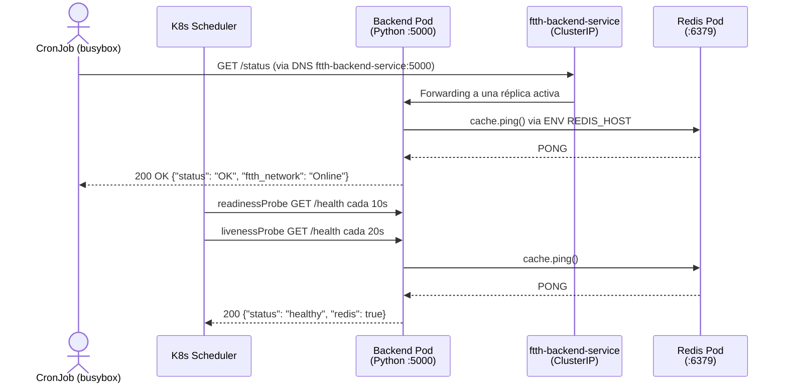

# Backend — API Python / Flask

## Visión General

El Backend es el cerebro de la plataforma FTTH. Es un microservicio desarrollado en **Python con Flask** que actúa como capa intermedia entre el Frontend y la base de datos Redis.

Su responsabilidad es exponer un endpoint HTTP que consulta el estado de la red y reporta si la infraestructura de fibra óptica está operativa. Es el único componente del clúster que habla directamente con Redis.

| Recurso | Nombre | Propósito |
|---|---|---|
| `Deployment` | `ftth-backend` | Gestiona las 2 réplicas del microservicio Python |
| `Service` | `ftth-backend-service` | Expone el puerto `5000` dentro del clúster (ClusterIP) |

El flujo de datos es el siguiente:



---

## Desglose Técnico

### Código Fuente — `app.py`

```python
from flask import Flask, jsonify
import redis
import os

app = Flask(__name__)

# Nos conectamos a Redis usando el nombre del Service de Kubernetes
redis_host = os.getenv("REDIS_HOST", "ftth-redis-service")
cache = redis.Redis(host=redis_host, port=6379, db=0, decode_responses=True)

@app.route('/status')
def status():
    try:
        cache.ping()
        return jsonify({
            "status": "OK",
            "message": "Backend conectado a Redis exitosamente",
            "ftth_network": "Online"
        })
    except redis.ConnectionError:
        return jsonify({
            "status": "ERROR",
            "message": "No se pudo conectar a Redis",
            "ftth_network": "Offline"
        }), 500

@app.route('/health')
def health():
    try:
        cache.ping()
        return jsonify({"status": "healthy", "redis": True}), 200
    except redis.ConnectionError:
        return jsonify({"status": "unhealthy", "redis": False}), 503

if __name__ == '__main__':
    app.run(host='0.0.0.0', port=5000)
```

#### ¿Por qué `os.getenv("REDIS_HOST", "ftth-redis-service")`?

Esta línea es el punto de integración entre el código Python y la infraestructura de Kubernetes, y merece especial atención.

La aplicación **no tiene la dirección de Redis hardcodeada**. Lee la variable de entorno `REDIS_HOST` en tiempo de ejecución. Si la variable no existe, usa el valor por defecto `ftth-redis-service`.

Este patrón permite que la misma imagen Docker funcione en cualquier entorno:

| Entorno | Valor de `REDIS_HOST` |
|---|---|
| Desarrollo local (Docker Compose) | `localhost` o `redis` |
| Kubernetes (este proyecto) | `ftth-redis-service` (el DNS del Service) |
| Staging / Producción | La dirección del servicio gestionado (ej. AWS ElastiCache) |

!!! info "Cómo funciona el DNS interno de Kubernetes"
    Cuando se crea un Service llamado `ftth-redis-service` en el namespace `default`, el componente `CoreDNS` del clúster registra automáticamente ese nombre. Cualquier Pod dentro del clúster puede resolver `ftth-redis-service` como si fuera un hostname de internet, sin necesidad de conocer la IP del Pod (que es efímera y cambia con cada reinicio). Este es el mecanismo de **Service Discovery** nativo de Kubernetes.

#### ¿Por qué el endpoint `/health`?

A diferencia del endpoint `/status` (orientado al CronJob para reportar estado de red), el endpoint `/health` está diseñado exclusivamente para las **probes de Kubernetes**. Es el contrato entre el Deployment y el orquestador: si responde HTTP 200, el Pod está sano; si responde 503 (Redis caído), Kubernetes lo considera no saludable.

La separación de endpoints evita que las probes y el monitoreo de red compartan la misma ruta, permitiendo que cada consumidor tenga su propio contrato.

#### ¿Por qué `host='0.0.0.0'` en Flask?

Por defecto, Flask escucha únicamente en `127.0.0.1` (loopback), lo que significa que solo acepta conexiones desde dentro del mismo proceso. En un contenedor, esto hace que la API sea inaccesible desde el exterior.

Al usar `host='0.0.0.0'`, Flask escucha en **todas las interfaces de red del contenedor**, incluyendo la interfaz virtual que Kubernetes asigna al Pod. Sin esto, el Service nunca podría enrutar tráfico al contenedor.

---

### Dockerfile — `src/backend/Dockerfile`

```dockerfile
FROM python:3.9-alpine
WORKDIR /app
COPY requirements.txt .
RUN pip install --no-cache-dir -r requirements.txt
COPY app.py .
EXPOSE 5000
CMD ["python", "app.py"]
```

!!! tip "Por qué Alpine y por qué copiar requirements.txt antes que app.py"
    Dos decisiones de optimización en el Dockerfile:

    1. **`python:3.9-alpine`**: La imagen Alpine de Python pesa ~50 MB frente a ~900 MB de la imagen base de Debian. En un entorno Kind con recursos limitados, esto es significativo.

    2. **Copiar `requirements.txt` antes de `app.py`**: Docker construye imágenes por capas. Si `app.py` cambia pero `requirements.txt` no, Docker reutiliza la caché de la capa de `pip install`, ahorrando entre 30 segundos y varios minutos en reconstrucciones sucesivas.

---

### Deployment — `backend-deployment.yaml`

```yaml
apiVersion: apps/v1
kind: Deployment
metadata:
  name: ftth-backend
  labels:
    app: ftth-backend
    tier: backend
spec:
  replicas: 2
  selector:
    matchLabels:
      app: ftth-backend
  strategy:
    type: RollingUpdate
    rollingUpdate:
      maxSurge: 1
      maxUnavailable: 0
  template:
    metadata:
      labels:
        app: ftth-backend
    spec:
      containers:
      - name: python-api
        image: ftth-backend:v1
        imagePullPolicy: Never
        ports:
        - containerPort: 5000
        env:
        - name: REDIS_HOST
          value: "ftth-redis-service"
        resources:
          requests:
            memory: "64Mi"
            cpu: "50m"
          limits:
            memory: "128Mi"
            cpu: "100m"
        readinessProbe:
          httpGet:
            path: /health
            port: 5000
          initialDelaySeconds: 5
          periodSeconds: 10
          timeoutSeconds: 2
          failureThreshold: 3
        livenessProbe:
          httpGet:
            path: /health
            port: 5000
          initialDelaySeconds: 15
          periodSeconds: 20
          timeoutSeconds: 2
          failureThreshold: 3
        lifecycle:
          preStop:
            exec:
              command: ["/bin/sh", "-c", "sleep 30"]
```

#### `imagePullPolicy: Never` — La clave para entornos Kind

Esta directiva es crítica en este laboratorio y merece una explicación detallada.

Por defecto, Kubernetes intenta descargar las imágenes desde un registry (Docker Hub, GHCR, etc.). El problema es que la imagen `ftth-backend:v1` es una imagen **local** construida en tu PC, que no existe en ningún registry público.

Sin esta directiva, todos los Pods del Backend quedarían atascados en el estado `ErrImageNeverPull` o `ImagePullBackOff`.

El flujo correcto para entornos Kind es:

```bash
# 1. Construir la imagen localmente
docker build -t ftth-backend:v1 ./src/backend/

# 2. Inyectar la imagen directamente en los nodos del clúster Kind
kind load docker-image ftth-backend:v1 --name ftth-cluster

# 3. Kubernetes encuentra la imagen localmente gracias a imagePullPolicy: Never
kubectl apply -f k8s/03-deployments/backend-deployment.yaml
```

!!! warning "Este patrón es exclusivo de entornos locales"
    En un entorno de producción real, siempre se utiliza un registry privado (ECR, GCR, GHCR) con `imagePullPolicy: IfNotPresent` o `Always`. El patrón `Never` es una solución específica para el problema de aislamiento de red de Kind.

#### Variables de entorno (`env`)

```yaml
env:
- name: REDIS_HOST
  value: "ftth-redis-service"
```

Esta sección inyecta la variable de entorno `REDIS_HOST` en el contenedor en el momento de su creación. El proceso Python la lee con `os.getenv("REDIS_HOST")` para saber a dónde conectarse.

!!! tip "El siguiente paso: usar Secrets"
    En este proyecto, el valor de `REDIS_HOST` es seguro para exponer en texto plano. Sin embargo, si Redis requiriera una contraseña, el patrón correcto sería:
    ```yaml
    env:
    - name: REDIS_PASSWORD
      valueFrom:
        secretKeyRef:
          name: redis-credentials
          key: password
    ```
    Nunca se escribiría la contraseña directamente en el manifiesto del Deployment.

#### Resource Requests y Limits

```yaml
resources:
  requests:
    memory: "64Mi"
    cpu: "50m"
  limits:
    memory: "128Mi"
    cpu: "100m"
```

Flask es un framework ligero de Python. En condiciones normales de este laboratorio (pocas peticiones, lógica simple), `64Mi` de memoria y `50m` de CPU son suficientes para que el proceso Python arranque y opere establemente.

El límite de `128Mi` actúa como protección: si por alguna razón la API tuviera un memory leak, el kernel terminaría el proceso (`OOMKilled`) antes de que afecte a otros Pods del nodo.

#### `strategy` — RollingUpdate con `maxUnavailable: 0`

```yaml
strategy:
  type: RollingUpdate
  rollingUpdate:
    maxSurge: 1
    maxUnavailable: 0
```

Esta configuración es la clave del **zero-downtime deployment**. `maxUnavailable: 0` le dice a Kubernetes: "no mates ningún pod viejo hasta que el nuevo esté listo". `maxSurge: 1` permite tener un pod extra durante la transición. Con 2 réplicas, el flujo es:

1. K8s crea un nuevo Pod (total: 3 pods — 2 viejos + 1 nuevo)
2. Espera a que la readinessProbe del nuevo responda HTTP 200
3. Recién entonces termina un Pod viejo
4. Repite hasta reemplazar los 2 pods

#### `readinessProbe` y `livenessProbe` — Health checks automáticos

```yaml
readinessProbe:
  httpGet:
    path: /health
    port: 5000
  initialDelaySeconds: 5
  periodSeconds: 10
  timeoutSeconds: 2
  failureThreshold: 3

livenessProbe:
  httpGet:
    path: /health
    port: 5000
  initialDelaySeconds: 15
  periodSeconds: 20
  timeoutSeconds: 2
  failureThreshold: 3
```

| Probe | Endpoint | `initialDelaySeconds` | `periodSeconds` | Consecuencia del fallo |
|---|---|---|---|---|
| `readiness` | `GET /health` | 5s | 10s | Se quita del Service (no recibe tráfico) |
| `liveness` | `GET /health` | 15s | 20s | K8s reinicia el Pod |

El endpoint `/health` verifica que Flask responda **y** que Redis sea accesible. Si Redis está caído, la probe falla y el Pod se aísla automáticamente sin intervención manual.

#### `lifecycle.preStop` — Graceful shutdown

```yaml
lifecycle:
  preStop:
    exec:
      command: ["/bin/sh", "-c", "sleep 30"]
```

Cuando Kubernetes decide terminar un Pod (por Rolling Update, drenado de nodo, etc.), el flujo es:

1. El Pod pasa a estado `Terminating`
2. Se ejecuta el hook `preStop` (este `sleep 30`)
3. Se envía `SIGTERM` al proceso principal (Flask)
4. Kubernetes espera `terminationGracePeriodSeconds` (default 30s)
5. Si el proceso no terminó, envía `SIGKILL`

El `sleep 30` dentro del preStop retrasa el paso 3, dando tiempo a que kube-proxy en todos los nodos actualice sus reglas de iptables/IPVS y dejen de enrutar tráfico al Pod saliente. Sin este retraso, las conexiones en curso recibirían un RST.

!!! warning "`sleep 30` = `terminationGracePeriodSeconds`"
    El duración total del graceful shutdown es `preStop (30s)` + `terminationGracePeriodSeconds (30s)` = hasta 60s. Esto es deliberado para entornos de laboratorio. En producción, se usaría `nginx -s quit` o `kill -SIGTERM` en lugar del sleep.

---

### Service — `backend-service.yaml`

```yaml
apiVersion: v1
kind: Service
metadata:
  name: ftth-backend-service
spec:
  type: ClusterIP
  selector:
    app: ftth-backend
  ports:
    - port: 5000
      targetPort: 5000
```

#### ¿Por qué ClusterIP y no NodePort?

Esta es una decisión arquitectónica deliberada de seguridad.

El Backend **nunca debe ser accesible directamente desde internet o desde el host**. Su función es ser un servicio interno al que solo acceden el CronJob y, eventualmente, el Frontend.

| Tipo de Service | Accesible desde | Uso en este proyecto |
|---|---|---|
| `ClusterIP` | Solo dentro del clúster | Backend, Redis |
| `NodePort` | Host local y red local | Frontend (dashboard) |
| `LoadBalancer` | Internet (requiere cloud provider) | No utilizado |

Al usar `ClusterIP`, el Backend queda protegido detrás de la red interna del clúster. Ningún proceso externo puede llegar al puerto `5000` directamente, reduciendo la superficie de ataque.

!!! info "Cómo funciona el selector del Service"
    El campo `selector: app: ftth-backend` le indica al Service a qué Pods debe enrutar el tráfico. Kubernetes monitorea continuamente todos los Pods con ese label y actualiza automáticamente la lista de endpoints. Si un Pod cae y es reemplazado, el Service redirige el tráfico al nuevo Pod sin ninguna intervención manual.

---

## Instrucciones de Operación

### Construir e inyectar la imagen (obligatorio en Kind)

```bash
# Construir la imagen desde el código fuente
docker build -t ftth-backend:v1 ./src/backend/

# Inyectarla en los nodos del clúster Kind
kind load docker-image ftth-backend:v1 --name ftth-cluster
```

### Aplicar los recursos

```bash
kubectl apply -f k8s/03-deployments/backend-deployment.yaml
kubectl apply -f k8s/05-services/backend-service.yaml
```

### Verificar el estado

```bash
# Estado del Deployment
kubectl get deployment ftth-backend

# Ver Pods, su estado y en qué nodo corren
kubectl get pods -l app=ftth-backend -o wide

# Ver los endpoints que el Service tiene registrados
kubectl get endpoints ftth-backend-service
```

### Probar el endpoint `/health` (health check)

Desde el host local usando port-forward:

```bash
kubectl port-forward svc/ftth-backend-service 5000:5000
```

```bash
curl -v http://localhost:5000/health
```

Respuesta esperada:

```json
{"redis": true, "status": "healthy"}
```

HTTP 200 si Redis responde, HTTP 503 si Redis está caído.

### Probar el endpoint `/status` (monitoreo de red) desde dentro del clúster

Dado que el Service es ClusterIP, no es accesible desde el host directamente. Para probarlo, lanza un Pod temporal con `curl` instalado:

```bash
kubectl run test-curl --image=curlimages/curl --rm -it --restart=Never -- \
  curl -s http://ftth-backend-service:5000/status
```

La respuesta esperada cuando Redis está operativo:

```json
{
  "ftth_network": "Online",
  "message": "Backend conectado a Redis exitosamente",
  "status": "OK"
}
```

### Debugging

```bash
# Ver logs de la API en tiempo real
kubectl logs -l app=ftth-backend -f --tail=100

# Verificar las variables de entorno inyectadas en el contenedor
kubectl exec -it deployment/ftth-backend -- env | grep REDIS

# Ver eventos del Deployment (útil para diagnosticar ImagePullBackOff o CrashLoopBackOff)
kubectl describe deployment ftth-backend
kubectl describe pod -l app=ftth-backend

# Ver todos los eventos recientes del namespace
kubectl get events --sort-by=.lastTimestamp | grep -i backend
```

!!! warning "Síntoma común: `ConnectionRefusedError` en los logs"
    Si los logs del Backend muestran un error de conexión a Redis, verifica que el Pod de Redis esté corriendo **antes** de que el Backend intente conectarse:
    ```bash
    kubectl get pods -l app=ftth-redis
    ```
    Si Redis no está listo, el Backend fallará su primer `cache.ping()` y el CronJob reportará `ftth_network: Offline`. Esto es comportamiento esperado y se autocorrige cuando Redis levanta.
