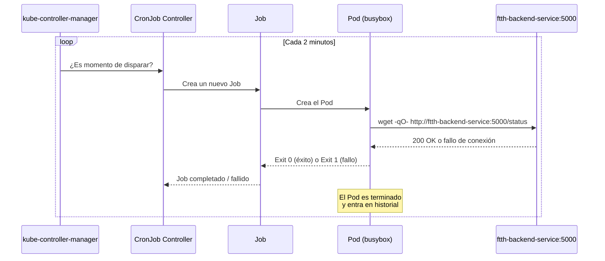

# Agente de Monitoreo — CronJob (Network Checker)

## Visión General

El Agente de Monitoreo es el componente más liviano del clúster pero, desde el punto de vista de la observabilidad, uno de los más importantes. Su función es actuar como un **watchdog de red interno**: cada 2 minutos lanza un Job efímero que verifica si el Backend está respondiendo correctamente.

A diferencia del resto de los componentes (Deployments que corren indefinidamente), el CronJob no es un proceso permanente. Crea Pods que nacen, ejecutan una tarea y mueren. Este patrón es fundamental para el CKA y representa la forma idiomática de Kubernetes de gestionar tareas automatizadas y recurrentes.

| Recurso | Nombre | Tipo de Workload |
|---|---|---|
| `CronJob` | `ftth-network-checker` | Batch — Pods efímeros programados en el tiempo |
| Pod resultante | `ftth-network-checker-<hash>` | Creado por el Job, vive ~segundos |

El flujo de ejecución es el siguiente:



---

## Desglose Técnico

### Manifiesto — `network-checker-cronjob.yaml`

```yaml
apiVersion: batch/v1
kind: CronJob
metadata:
  name: ftth-network-checker
  labels:
    app: ftth-network-checker
    tier: worker
spec:
  schedule: "*/2 * * * *"
  successfulJobsHistoryLimit: 3
  failedJobsHistoryLimit: 1
  jobTemplate:
    spec:
      template:
        spec:
          containers:
          - name: checker
            image: busybox:latest
            imagePullPolicy: IfNotPresent
            command:
            - /bin/sh
            - -c
            - |
              echo "--- Iniciando chequeo de salud de la red FTTH ---"
              date
              wget -qO- http://ftth-backend-service:5000/status || echo "¡Alerta! Fallo al conectar con el Backend de la red."
              echo -e "\n--- Chequeo finalizado exitosamente ---"
            resources:
              requests:
                memory: "16Mi"
                cpu: "10m"
              limits:
                memory: "32Mi"
                cpu: "50m"
          restartPolicy: OnFailure
```

---

### Anatomía de un CronJob: La jerarquía de recursos

Esta es la parte más confusa del CronJob para quienes lo ven por primera vez, y es un punto frecuente en el examen CKA. Hay tres niveles de recursos anidados:

```
CronJob  →  crea  →  Job  →  crea  →  Pod
```

- **`CronJob`**: El "reloj". Contiene la expresión `schedule` y el `jobTemplate`. No ejecuta nada por sí solo.
- **`Job`**: El "ejecutor". Se crea según el schedule y garantiza que el Pod se complete al menos una vez con éxito.
- **`Pod`**: El "trabajador". Corre el contenedor real, ejecuta el script y termina.

Esta jerarquía explica por qué el YAML del CronJob tiene tantos niveles de `spec` anidados: `spec` del CronJob → `jobTemplate.spec` del Job → `template.spec` del Pod.

!!! info "¿Por qué existe el Job como capa intermedia?"
    El `Job` es el responsable de la **garantía de completitud**. Si el Pod falla (crash, error de red), el Job crea un Pod de reemplazo según la política definida en `restartPolicy`. El CronJob solo sabe cuándo disparar; el Job sabe cómo garantizar que la tarea se complete.

---

### La expresión `schedule` — Sintaxis CRON

```yaml
schedule: "*/2 * * * *"
```

La sintaxis CRON tiene 5 campos, separados por espacios:

```
 ┌──────────── Minuto        (0-59)
 │  ┌─────────── Hora          (0-23)
 │  │  ┌──────────── Día del mes   (1-31)
 │  │  │  ┌─────────── Mes          (1-12)
 │  │  │  │  ┌──────────── Día de la semana (0-6, donde 0 = Domingo)
 │  │  │  │  │
*/2  *  *  *  *
```

`*/2` en el campo de minutos significa "cada 2 minutos". El asterisco `*` en los demás campos significa "cualquier valor".

| Expresión | Significado |
|---|---|
| `*/2 * * * *` | Cada 2 minutos |
| `0 * * * *` | Al inicio de cada hora |
| `0 2 * * *` | Todos los días a las 2:00 AM |
| `0 0 * * 1` | Cada lunes a medianoche |
| `*/5 9-17 * * 1-5` | Cada 5 minutos, de 9 a 17h, de lunes a viernes |

!!! tip "Herramienta de referencia"
    Para construir y validar expresiones CRON, [crontab.guru](https://crontab.guru) es la herramienta estándar de la industria. Traduce cualquier expresión a lenguaje natural.

---

### `restartPolicy: OnFailure` — La política de reinicio del Pod

```yaml
restartPolicy: OnFailure
```

Esta directiva le dice al `kubelet` qué hacer cuando el contenedor termina con un código de error (exit code distinto de 0).

!!! warning "Regla de oro: Los Pods de Job/CronJob NUNCA usan `restartPolicy: Always`"
    `Always` es el valor por defecto para los Pods de Deployments. Si un Pod de Job usara `Always`, el `kubelet` lo reiniciaría indefinidamente incluso después de completarse con éxito (exit code 0), entrando en un bucle infinito. Para Jobs y CronJobs, solo se permiten `OnFailure` o `Never`.

| Valor | Comportamiento |
|---|---|
| `Always` | Reinicia siempre (solo para Deployments) |
| `OnFailure` | Reinicia solo si el Pod termina con error. Si tiene éxito, el Pod queda en estado `Completed` |
| `Never` | Nunca reinicia. Si falla, el Job crea un Pod nuevo desde cero |

En este caso, `OnFailure` es la opción correcta: si el script de `wget` falla por un problema de red transitorio, el mismo Pod se reinicia y reintenta sin necesidad de crear uno nuevo.

---

### Control del historial de Jobs

```yaml
successfulJobsHistoryLimit: 3
failedJobsHistoryLimit: 1
```

Cada vez que el CronJob dispara, crea un Job. Si no se limita el historial, el clúster acumularía cientos de Jobs y Pods completados, consumiendo recursos de `etcd` y saturando el output de `kubectl get pods`.

| Campo | Valor | Comportamiento |
|---|---|---|
| `successfulJobsHistoryLimit` | `3` | Conserva los últimos 3 Jobs exitosos para inspección |
| `failedJobsHistoryLimit` | `1` | Conserva solo el último Job fallido |

!!! tip "Por qué conservar al menos 1 Job fallido"
    Mantener `failedJobsHistoryLimit: 1` permite que, ante una alerta de fallo, puedas ejecutar `kubectl logs` sobre el Pod del último Job fallido para diagnosticar el problema. Si el límite fuera 0, el Pod se borraría inmediatamente y perderías el contexto del error.

---

### La imagen `busybox` y el script de verificación

```yaml
image: busybox:latest
imagePullPolicy: IfNotPresent
command:
- /bin/sh
- -c
- |
  echo "--- Iniciando chequeo de salud de la red FTTH ---"
  date
  wget -qO- http://ftth-backend-service:5000/status || echo "¡Alerta! Fallo al conectar con el Backend."
  echo -e "\n--- Chequeo finalizado exitosamente ---"
```

**¿Por qué `busybox`?**

BusyBox es una imagen de Linux que combina cientos de utilidades de Unix (`sh`, `wget`, `ping`, `nc`, `date`, etc.) en un único binario que pesa menos de **2 MB**. Es la elección estándar en Kubernetes para tareas de scripting y diagnóstico donde no se necesita un entorno completo.

**¿Qué hace exactamente el script?**

El comando clave es:
```bash
wget -qO- http://ftth-backend-service:5000/status || echo "¡Alerta!"
```

- `wget -qO-`: Descarga la URL en modo silencioso (`-q`) y vuelca la respuesta a la salida estándar (`-O-`) en lugar de a un archivo.
- `|| echo "¡Alerta!"`: El operador `||` (OR lógico de shell) ejecuta el `echo` solo si `wget` termina con un código de error (es decir, si la conexión falló o el servidor respondió con un código HTTP de error).
- El resultado queda registrado en los logs del Pod, disponible con `kubectl logs`.

**`imagePullPolicy: IfNotPresent`**

A diferencia del Backend (que usa `Never` porque la imagen es local), BusyBox es una imagen pública. `IfNotPresent` le dice al `kubelet` que descargue la imagen solo si no está en la caché del nodo. Esto evita pulls redundantes en cada ejecución del CronJob.

---

### Resource Requests y Limits mínimos

```yaml
resources:
  requests:
    memory: "16Mi"
    cpu: "10m"
  limits:
    memory: "32Mi"
    cpu: "50m"
```

El script ejecuta un `wget` y termina en menos de 2 segundos. `10m` de CPU (1% de un núcleo) y `16Mi` de RAM son más que suficientes. Estos valores tan bajos son intencionales: demuestran que el scheduler puede acomodar cientos de estos Jobs efímeros en paralelo sin impactar los workloads de larga duración del clúster.

---

## Instrucciones de Operación

### Aplicar el recurso

```bash
kubectl apply -f k8s/03-deployments/network-checker-cronjob.yaml
```

### Verificar el estado

```bash
# Ver el CronJob y cuándo fue su última ejecución
kubectl get cronjob ftth-network-checker

# Ver los Jobs generados por el CronJob
kubectl get jobs -l app=ftth-network-checker

# Ver los Pods generados (incluidos los completados)
kubectl get pods -l app=ftth-network-checker
```

El output esperado de `kubectl get pods` mostrará Pods en estado `Completed`:

```
NAME                                    READY   STATUS      RESTARTS   AGE
ftth-network-checker-28934520-xk7p2    0/1     Completed   0          2m
ftth-network-checker-28934522-9bvq1    0/1     Completed   0          4m
```

### Ver los logs de una ejecución

```bash
# Ver los logs del Job más reciente
kubectl logs -l app=ftth-network-checker --tail=20

# Ver logs de un Pod específico (completado)
kubectl logs <nombre-del-pod-del-cronjob>
```

Output esperado cuando todo funciona correctamente:

```
--- Iniciando chequeo de salud de la red FTTH ---
Mon May 12 12:00:00 UTC 2026
{"ftth_network": "Online", "message": "Backend conectado a Redis exitosamente", "status": "OK"}

--- Chequeo finalizado exitosamente ---
```

### Disparar una ejecución manual inmediata

En lugar de esperar 2 minutos, puedes crear un Job manualmente desde el CronJob para probar sin delay:

```bash
kubectl create job test-manual --from=cronjob/ftth-network-checker
kubectl logs -l job-name=test-manual -f
```

### Suspender y reanudar el CronJob

```bash
# Suspender (el CronJob deja de disparar nuevos Jobs)
kubectl patch cronjob ftth-network-checker -p '{"spec":{"suspend":true}}'

# Reanudar
kubectl patch cronjob ftth-network-checker -p '{"spec":{"suspend":false}}'

# Ver si está suspendido
kubectl get cronjob ftth-network-checker
```

### Debugging

```bash
# Ver el historial completo de Jobs del CronJob
kubectl describe cronjob ftth-network-checker

# Diagnosticar un Pod en estado Error o CrashLoopBackOff
kubectl describe pod <nombre-del-pod-fallido>

# Ver eventos del namespace para fallas de scheduling
kubectl get events --sort-by=.lastTimestamp | grep -i network-checker
```

!!! warning "Síntoma: Pods del CronJob en estado `Error` de forma recurrente"
    Si los Pods del CronJob terminan en `Error` en lugar de `Completed`, lo más probable es que el Backend no esté respondiendo. Verifica el estado del Backend antes de profundizar en el CronJob:
    ```bash
    kubectl get pods -l app=ftth-backend
    kubectl logs -l app=ftth-backend --tail=20
    ```
    Si el Backend está caído, el `wget` del CronJob fallará con código de error y el Pod entrará en el ciclo de `OnFailure` hasta agotar los reintentos.
