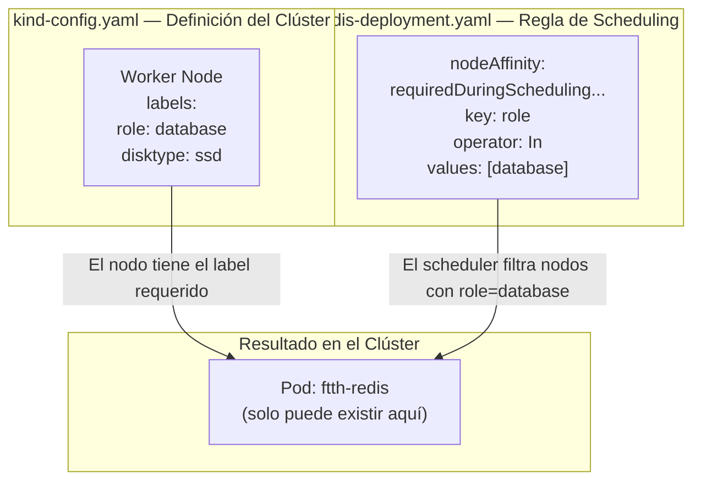

# Base de Datos — Redis

## Visión General

Redis actúa como la **capa de almacenamiento de estado** de la plataforma FTTH. Es un almacén de datos en memoria (in-memory) que el Backend consulta para verificar la conectividad de la red y persistir el estado de los nodos de fibra óptica.

A diferencia del Frontend y el Backend, el Pod de Redis **no puede ejecutarse en cualquier nodo del clúster**. Está anclado al nodo Worker mediante una regla de **Node Affinity**, simulando un escenario real donde los motores de base de datos deben residir en hardware con características específicas de almacenamiento.

| Recurso | Nombre | Propósito |
|---|---|---|
| `Deployment` | `ftth-redis` | Gestiona la única réplica del motor de caché |
| `Service` | `ftth-redis-service` | Expone el puerto `6379` internamente (ClusterIP) |

El vínculo entre la infraestructura y el workload funciona así:



---

## Desglose Técnico

### Node Affinity — El concepto central de este módulo

Esta es la configuración más relevante para el CKA en todo este componente. Analiza el bloque completo:

```yaml
spec:
  affinity:
    nodeAffinity:
      requiredDuringSchedulingIgnoredDuringExecution:
        nodeSelectorTerms:
        - matchExpressions:
          - key: role
            operator: In
            values:
            - database
```

Cada parte de esta sintaxis tiene un significado preciso:

**`nodeAffinity`** — Le dice al `kube-scheduler` que aplique reglas basadas en los *labels* de los nodos, no en los labels de los Pods.

**`requiredDuringSchedulingIgnoredDuringExecution`** — Esta es la variante **estricta** (hard) del Node Affinity. Se divide en dos partes:

| Segmento | Significado |
|---|---|
| `requiredDuringScheduling` | El Pod **nunca** será programado en un nodo que no cumpla la regla. Si no hay nodos disponibles, el Pod queda en estado `Pending` indefinidamente. |
| `IgnoredDuringExecution` | Si el label del nodo cambia o se elimina mientras el Pod ya está corriendo, Kubernetes **no lo desaloja**. El Pod sigue ejecutándose. |

!!! info "La variante preferida: `preferredDuringSchedulingIgnoredDuringExecution`"
    Existe una variante "soft" del Node Affinity. Con `preferred`, el scheduler intentará colocar el Pod en un nodo que cumpla la regla, pero si no existe ninguno, lo programará en cualquier nodo disponible en lugar de dejarlo en `Pending`. En este proyecto usamos `required` para demostrar control estricto de placement.

**`matchExpressions`** — Es más expresivo que un simple `nodeSelector`. Permite usar operadores lógicos:

| Operador | Comportamiento |
|---|---|
| `In` | El valor del label debe estar en la lista provista |
| `NotIn` | El valor del label NO debe estar en la lista |
| `Exists` | El label debe existir (sin importar su valor) |
| `DoesNotExist` | El label no debe existir en el nodo |

#### La conexión con `kind-config.yaml`

La regla de Node Affinity solo funciona porque el nodo Worker fue declarado con el label correcto en `kind-config.yaml`:

```yaml
# kind-config.yaml
nodes:
  - role: worker
    labels:
      role: database    # <-- Este label es el que la regla de Affinity busca
      disktype: ssd
```

Cuando Kind crea el clúster, aplica esos labels al nodo Worker. El `kube-scheduler`, al recibir el Pod de Redis, filtra todos los nodos del clúster buscando aquellos con `role=database`. Solo el nodo Worker cumple la condición, por lo que el Pod se programa exclusivamente allí.

!!! tip "Cómo verificar los labels de los nodos"
    ```bash
    kubectl get nodes --show-labels
    ```
    Deberías ver el nodo Worker con `role=database` y `disktype=ssd` en su columna de labels.

!!! warning "¿Qué pasa si el Worker no tiene el label?"
    Si por alguna razón el nodo Worker no tiene el label `role=database`, el Pod de Redis quedará en estado `Pending` con el evento:
    ```
    Warning  FailedScheduling  0/2 nodes are available: 1 node(s) had untolerated taint,
    1 node(s) didn't match Pod's node affinity/selector.
    ```
    Para corregirlo sin recrear el clúster, puedes añadir el label manualmente:
    ```bash
    kubectl label node <nombre-del-nodo-worker> role=database
    ```

---

### Deployment — `redis-deployment.yaml`

```yaml
apiVersion: apps/v1
kind: Deployment
metadata:
  name: ftth-redis
  labels:
    app: ftth-redis
    tier: database
spec:
  replicas: 1
  selector:
    matchLabels:
      app: ftth-redis
  template:
    metadata:
      labels:
        app: ftth-redis
    spec:
      affinity:
        nodeAffinity:
          requiredDuringSchedulingIgnoredDuringExecution:
            nodeSelectorTerms:
            - matchExpressions:
              - key: role
                operator: In
                values:
                - database
      containers:
      - name: redis-cache
        image: redis:alpine
        ports:
        - containerPort: 6379
        resources:
          requests:
            memory: "64Mi"
            cpu: "50m"
          limits:
            memory: "128Mi"
            cpu: "100m"
```

#### ¿Por qué `replicas: 1`?

Redis opera en modo standalone en este laboratorio. A diferencia del Frontend y el Backend (stateless), Redis es un componente **stateful**: sus datos residen en memoria ligados a ese Pod específico.

Escalar Redis a múltiples réplicas requiere un modo de replicación especial (Redis Sentinel o Redis Cluster) que está fuera del alcance de este laboratorio. Usar `replicas: 2` sin esa configuración crearía dos instancias independientes y desincronizadas, lo cual sería incorrecto.

!!! info "Stateful vs Stateless en Kubernetes"
    El Frontend y el Backend son **stateless**: cualquier réplica puede responder a cualquier petición porque no guardan estado local. Por eso escalan fácilmente a 2 o más réplicas.

    Redis es **stateful**: su valor reside en memoria dentro del Pod. Para workloads stateful en producción, Kubernetes ofrece el recurso `StatefulSet` en lugar de `Deployment`, que garantiza identidad de red estable y almacenamiento persistente por réplica. En este laboratorio se usa `Deployment` por simplicidad, aceptando que los datos se pierden si el Pod se reinicia.

#### Resource Requests y Limits para Redis

```yaml
resources:
  requests:
    memory: "64Mi"
    cpu: "50m"
  limits:
    memory: "128Mi"
    cpu: "100m"
```

Redis es un motor extremadamente eficiente. En modo standalone con un dataset pequeño como el de este laboratorio, `64Mi` de RAM son más que suficientes para el proceso y el dataset en memoria.

El límite de `128Mi` es la protección crítica aquí: Redis por defecto **no tiene límite de memoria** y continuará creciendo hasta llenar el nodo entero si no se lo restringe. En producción, además del `limits` de Kubernetes, se configura `maxmemory` dentro de Redis para controlar qué hacer cuando se alcanza el techo (política de eviction).

---

### Service — `redis-service.yaml`

```yaml
apiVersion: v1
kind: Service
metadata:
  name: ftth-redis-service
spec:
  type: ClusterIP
  selector:
    app: ftth-redis
  ports:
    - port: 6379
      targetPort: 6379
```

#### ¿Por qué ClusterIP?

Redis **nunca debe estar expuesto fuera del clúster**. Es la capa de datos más sensible de la arquitectura: exponer el puerto `6379` al exterior sería una vulnerabilidad crítica de seguridad.

El Service de tipo `ClusterIP` garantiza que el único componente que puede hablar con Redis es el Backend Python, usando el DNS interno `ftth-redis-service:6379`.

!!! warning "Redis sin autenticación"
    En este laboratorio, Redis opera sin contraseña (`requirepass` no configurado). Esto es aceptable porque el acceso está restringido por red a nivel de clúster. En un entorno de producción, siempre se configura autenticación y se inyecta la contraseña mediante un `Secret` de Kubernetes, nunca en texto plano.

---

## Instrucciones de Operación

### Aplicar los recursos

```bash
kubectl apply -f k8s/02-deployments/redis-deployment.yaml
kubectl apply -f k8s/03-services/redis-service.yaml
```

### Verificar el estado y el scheduling

```bash
# Ver el estado del Deployment
kubectl get deployment ftth-redis

# Verificar en qué nodo fue programado el Pod (columna NODE)
kubectl get pod -l app=ftth-redis -o wide

# Confirmar los labels del nodo Worker
kubectl get nodes --show-labels

# Ver los eventos de scheduling del Pod
kubectl describe pod -l app=ftth-redis | grep -A 10 "Events:"
```

### Probar la conectividad con Redis desde dentro del clúster

```bash
# Abrir una sesión interactiva con el cliente redis-cli dentro del Pod
kubectl exec -it deployment/ftth-redis -- redis-cli

# Dentro de redis-cli, ejecutar un ping
127.0.0.1:6379> PING
PONG

# Ver información del servidor
127.0.0.1:6379> INFO server

# Ver el uso de memoria actual
127.0.0.1:6379> INFO memory
```

### Probar la conectividad desde otro Pod

```bash
# Lanzar un Pod temporal con redis-cli para probar el Service por DNS
kubectl run redis-test --image=redis:alpine --rm -it --restart=Never -- \
  redis-cli -h ftth-redis-service -p 6379 PING
```

La respuesta esperada es `PONG`.

### Debugging de Node Affinity

```bash
# Ver si el Pod está en Pending por falta de nodos compatibles
kubectl get pod -l app=ftth-redis

# Ver el mensaje de error del scheduler
kubectl describe pod -l app=ftth-redis | grep -A 5 "Warning"

# Si el nodo no tiene el label, añadirlo manualmente
kubectl label node <nombre-del-nodo-worker> role=database

# Verificar que el label fue aplicado
kubectl get node <nombre-del-nodo-worker> --show-labels
```

### Debugging de memoria y rendimiento

```bash
# Ver el consumo real de CPU y memoria (requiere Metrics Server activo)
kubectl top pod -l app=ftth-redis

# Ver los logs del proceso Redis
kubectl logs -l app=ftth-redis --tail=50
```

!!! tip "Síntoma: Pod en estado `Pending` tras el despliegue"
    Si el Pod de Redis queda en `Pending`, la causa más probable es que el nodo Worker no tiene el label `role=database`. Ejecuta `kubectl get nodes --show-labels` para confirmarlo y añade el label según las instrucciones de debugging anteriores.
