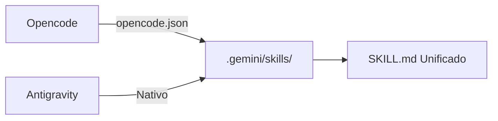

# Unificación de Skills — Reestructuración Definitiva del Arnés

## Visión General

Esta documentación detalla la consolidación de los agentes de IA (Antigravity y Opencode) en un único directorio unificado. El objetivo es eliminar la dicotomía de carpetas y establecer `.gemini/skills/` como la única fuente de la verdad para todo el ecosistema de *Harness Engineering*.

| Recurso | Nombre | Propósito |
|---|---|---|
| `Directorio` | `.gemini/skills/` | Aloja el conocimiento universal (SKILL.md) de todos los agentes |
| `Script` | `codegraph-summary.py` | Genera el mapa del proyecto para el contexto de la IA |
| `Configuración`| `opencode.json` | Configura Opencode para leer la carpeta unificada |



---

## Desglose Técnico

### Configuración del Ecosistema — `opencode.json`

```json
{
  "$schema": "https://opencode.ai/config.json",
  "instructions": ["AGENTS.md"],
  "skills": {
    "paths": [".gemini/skills"]
  },
  "permission": {
    "bash": "ask"
  }
}
```

#### ¿Por qué usar `.gemini/skills` y no `.skills`?
Antigravity tiene una regla nativa que lo obliga a buscar sus *skills* en la carpeta `.gemini/`. En lugar de forzar enlaces simbólicos (symlinks) o configuraciones complejas para usar un nombre neutral, se adoptó esta ruta como el estándar universal del proyecto, aprovechando la flexibilidad de Opencode para apuntar directamente hacia ella.

!!! info "Principio de Single Source of Truth"
    Cualquier cambio realizado en el `SKILL.md` de un agente impacta inmediatamente a todas las IAs que consumen este directorio, garantizando cero duplicación y evitando desincronizaciones de contexto.

---

## Instrucciones de Operación

### Aplicar los recursos

La reestructuración ya fue aplicada a nivel del sistema de archivos. Si necesitas crear un **nuevo agente**, debes inicializarlo directamente en el directorio nativo:

```bash
mkdir -p .gemini/skills/nuevo-agente
touch .gemini/skills/nuevo-agente/SKILL.md
```

### Verificar el estado

Puedes verificar que la configuración de Opencode apunte correctamente a la nueva fuente de verdad:

```bash
cat opencode.json | grep paths
```

### Debugging

Si el Orquestador falla al cargar el contexto estructural al inicio de la sesión, verifica que el script de CodeGraph se haya mudado correctamente:

```bash
ls -la .harness/scripts/codegraph-summary.py
```

!!! warning "Síntoma común: Opencode o Antigravity ignoran instrucciones"
    Si un agente no respeta sus protocolos, asegúrate de que estás editando el archivo `SKILL.md` dentro de `.gemini/skills/` y de que has eliminado cualquier rastro de la carpeta legacy `.opencode/skills/` que pueda estar generando conflicto.
