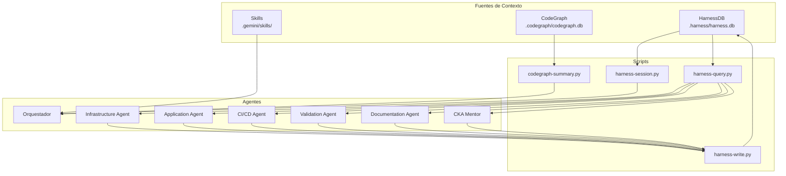

# HarnessDB — Memoria Persistente del Sistema de Agentes

## Visión General

HarnessDB es una base de datos SQLite que funciona como **memoria compartida** entre todos los agentes del sistema Harness Engineering. Complementa al CodeGraph (estructura de código) con contexto semántico: decisiones arquitectónicas, lecciones aprendidas, estado de recursos y trazabilidad de acciones.

| Artefacto | Ruta | Descripción |
|---|---|---|
| Base de datos | `.harness/harness.db` | DB SQLite (generada, no versionada) |
| Schema | `.harness/schema.sql` | Definición de tablas (versionado) |
| Seed | `.harness/seed.sql` | Datos iniciales del proyecto |
| Init script | `.harness/scripts/harness-init.py` | Crear/migrar la DB |
| Query script | `.harness/scripts/harness-query.py` | Consultas de lectura |
| Write script | `.harness/scripts/harness-write.py` | Registrar datos |
| Session script | `.harness/scripts/harness-session.py` | Resumen de sesión |

## Arquitectura



## Schema de la Base de Datos

### Tablas Principales

| Tabla | Propósito | Campos clave |
|---|---|---|
| `decisions` | Registro de Decisiones Arquitectónicas (ADR) | agent, domain, title, context, decision, alternatives, status |
| `context_snapshots` | Snapshots de estado del proyecto | trigger, description, cluster_state |
| `lessons_learned` | Lecciones aprendidas, errores, gotchas | agent, category, title, description, severity |
| `resource_registry` | Mapa vivo de recursos K8s del clúster | kind, name, namespace, manifest_path, validation_status |
| `agent_activity_log` | Trazabilidad de acciones de agentes | agent, action, target, summary, validation_result |

### Búsqueda Full-Text (FTS)

Las tablas `decisions` y `lessons_learned` tienen índices FTS5 que permiten búsquedas semánticas:

```bash
python3 .harness/scripts/harness-query.py --search "redis affinity"
```

## Instrucciones de Operación

### Inicialización

```bash
# Crear la DB por primera vez (incluye seed con datos del proyecto)
python3 .harness/scripts/harness-init.py

# Re-ejecutar es seguro (idempotente)
python3 .harness/scripts/harness-init.py
```

### Consultas

```bash
# Decisiones activas
python3 .harness/scripts/harness-query.py --decisions

# Decisiones por dominio
python3 .harness/scripts/harness-query.py --decisions --domain networking

# Lecciones por categoría
python3 .harness/scripts/harness-query.py --lessons --category gotcha

# Estado de los recursos
python3 .harness/scripts/harness-query.py --resources

# Actividad reciente
python3 .harness/scripts/harness-query.py --activity --last 10

# Búsqueda libre
python3 .harness/scripts/harness-query.py --search "imagePullPolicy"
```

### Escritura

```bash
# Registrar una decisión
python3 .harness/scripts/harness-write.py decision \
  --agent infrastructure \
  --domain networking \
  --title "Título de la decisión" \
  --context "Por qué se tomó" \
  --decision "Qué se decidió" \
  --tags "tag1, tag2"

# Registrar una lección
python3 .harness/scripts/harness-write.py lesson \
  --agent validation \
  --category gotcha \
  --title "Título del gotcha" \
  --description "Descripción detallada" \
  --severity warning

# Registrar un recurso
python3 .harness/scripts/harness-write.py resource \
  --kind Deployment \
  --name ftth-nuevo \
  --manifest-path k8s/03-deployments/nuevo.yaml

# Actualizar estado de validación
python3 .harness/scripts/harness-write.py update-status \
  --kind Deployment \
  --name ftth-backend \
  --validation-status healthy

# Registrar actividad
python3 .harness/scripts/harness-write.py activity \
  --agent infrastructure \
  --action create \
  --target "ftth-nuevo-deployment" \
  --summary "Creado nuevo deployment para componente X"
```

### Resumen de Sesión

```bash
# Ejecutar al inicio de cada sesión
python3 .harness/scripts/harness-session.py
```

Output ejemplo:
```
╔══════════════════════════════════════════════════════════════╗
║            📊 HARNESS SESSION BRIEF                        ║
╚══════════════════════════════════════════════════════════════╝
  📁 CodeGraph: 24 archivos indexados, 28 nodos, 27 relaciones
  📋 Decisiones: 8 activas (2 networking, 1 scheduling, ...)
  📚 Lecciones: 4 total (2 gotcha, 1 error, 1 pattern)
  🗂️  Recursos: 10 registrados (⚪10 unknown)
  📜 Actividad: ninguna registrada
```

## Flujo de Trabajo con HarnessDB

1. **Inicio de sesión**: El Orquestador ejecuta `harness-session.py` para cargar contexto
2. **Pre-tarea**: Cada agente ejecuta `harness-query.py` con filtros relevantes (Paso 0)
3. **Trabajo**: El agente opera normalmente siguiendo su protocolo
4. **Post-tarea**: El agente registra decisiones, lecciones y actividad (Paso final)
5. **Post-validación**: El Validation Agent actualiza `validation_status` de los recursos

## Debugging

```bash
# Verificar que la DB existe y tiene datos
python3 .harness/scripts/harness-init.py

# Consultar directamente con Python
python3 -c "
import sqlite3
conn = sqlite3.connect('.harness/harness.db')
for table in ['decisions', 'lessons_learned', 'resource_registry', 'agent_activity_log', 'context_snapshots']:
    count = conn.execute(f'SELECT COUNT(*) FROM {table}').fetchone()[0]
    print(f'{table}: {count} registros')
conn.close()
"
```
