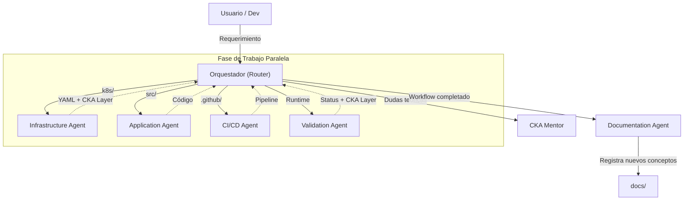

# Harness Engineering — Arquitectura de Agentes Especializados

## Visión General

Harness Engineering es un principio de diseño aplicado a sistemas de Inteligencia Artificial donde cada agente tiene un **contexto acotado**, una **responsabilidad única**, un **contrato claro** (input/output) y produce **fallas observables**. En el proyecto FTTH-K8s, esto resuelve el problema de contexto excesivo y consumo de tokens al dividir la asistencia en agentes especialistas.

| Recurso | Nombre | Propósito |
|---|---|---|
| `Agente` | `Orquestador` | Router de intenciones. Delega tareas a los subagentes y consolida resultados. |
| `Agente` | `Infrastructure Agent` | Especialista en manifiestos declarativos (`k8s/`) y topología del clúster. |
| `Agente` | `Application Agent` | Especialista en código fuente (`src/`, Flask, Nginx) y dependencias. |
| `Agente` | `CI/CD Agent` | Especialista en pipelines (`.github/workflows/`) y script `manage-env.sh`. |
| `Agente` | `Validation Agent` | Verificador de estado post-deploy en el clúster Kind (requiere permisos). |
| `Agente` | `Documentation Agent`| Post-processing hook secuencial que mantiene `docs/` siempre actualizada. |
| `Agente` | `CKA Mentor` | Tutor exclusivo para teoría CKA. Responde dudas sin tocar el código. |



---

## Filosofía V3: "Build Fast, Learn Deep"

El arnés (harness) está diseñado bajo la filosofía **AI Pair Programming**. 
En versiones anteriores, el sistema actuaba como un tutor restrictivo (*Gatekeeping*), reteniendo respuestas para forzar al usuario a pensar. 

En la versión actual (v3), el sistema prioriza la **velocidad de desarrollo**:
1. **Código Primero:** El agente entrega el manifiesto o código funcional, optimizado y listo para aplicar de forma inmediata.
2. **Explicación Después (CKA Layer):** Inmediatamente después del código, el agente anexa un bloque `CKA LEARNING` explicando qué hace el recurso, cómo se relaciona con el examen CKA y compartiendo tips oficiales.
3. **Documentación Automática:** Todo concepto nuevo aprendido se registra en el cheat-sheet automáticamente.

Esta separación ("la máquina escribe, el humano absorbe el concepto") aumenta radicalmente el *Time-to-Value* sin sacrificar el objetivo de certificación.

---

## Desglose Técnico

### Los Principios Aplicados — Estructura en `.gemini/skills/`

La arquitectura está completamente formalizada en la carpeta de skills. Cada agente tiene su propio `metadata.json` y `agent_protocol.md`, y los agentes técnicos cuentan con su propia `*_skill.md` (knowledge base).

#### ¿Por qué dividir el contexto (Contexto Acotado)?
Un agente no necesita leer todo el código fuente de Flask si solo va a modificar un manifiesto YAML de Kubernetes. Dividir el contexto reduce el consumo de tokens y minimiza las alucinaciones de la IA.

#### ¿Por qué usar un Orquestador (Responsabilidad Única)?
Evita que el usuario tenga que decidir qué agente usar en cada paso. El Orquestador funciona como una API unificada que descompone tareas complejas (ej. "Agregar un nuevo microservicio") en tareas que pueden ejecutarse en paralelo por los subagentes.

#### ¿Por qué el Documentation Agent es un paso secuencial obligatorio?
A diferencia de los agentes técnicos que corren en paralelo proponiendo soluciones, la documentación es una consecuencia de esas soluciones. El Documentation Agent actúa como un *hook* final, garantizando que el conocimiento del proyecto (`docs/`) nunca quede desactualizado respecto al código.

### Manejo de Contexto y Memoria (CodeGraph + HarnessDB)

El sistema para mantener el contexto y la memoria de las decisiones se basa en una arquitectura de **doble capa**, asegurando que los agentes comprendan el estado del proyecto sin releer todo el código:

1. **CodeGraph (La Memoria Estructural):** Entiende la "física" del repositorio (archivos, dependencias y relaciones). Vive en `.codegraph/codegraph.db`. Se consulta antes de cada tarea con `.opencode/scripts/codegraph-summary.py` y es obligatorio actualizarlo con `npx @colbymchenry/codegraph sync` ante cualquier cambio estructural (archivos nuevos, eliminados, etc).
2. **HarnessDB (La Memoria Semántica):** Sabe *por qué* están las cosas ahí y qué lecciones se aprendieron. Vive en `.harness/harness.db`. Se lee ejecutando `.harness/scripts/harness-session.py` para obtener un *Session Brief* (decisiones activas, lecciones aprendidas, actividad reciente). Se actualiza obligatoriamente al finalizar cada tarea usando `.harness/scripts/harness-write.py` para registrar `activity`, `decision` o `lesson`.

Este flujo unificado (**leer CodeGraph → leer HarnessDB → ejecutar tarea → escribir HarnessDB → sincronizar CodeGraph**) permite que la inteligencia colectiva de los agentes aumente iterativamente con cada intervención.

!!! info "Fase actual de implementación"
    El proyecto ya ha inicializado formalmente a los agentes y separado sus dominios en `.gemini/skills/` para Gemini (Antygravity) y `.opencode/skills/` para opencode. Los skills de opencode son "thin" y referencian el contenido de `.gemini/skills/` como fuente de verdad única. Esto provee una base firme, reglas claras y sincronización automática entre plataformas para que la IA colabore sin romper el estilo del código o de la infraestructura.

---

## Instrucciones de Operación

### Aplicar el flujo de agentes (Ejemplo Práctico)

1. **El Usuario solicita un cambio complejo**: "Agregar un endpoint `/metrics` al backend".
2. **El Orquestador descompone la tarea**:
    - Invoca al **Application Agent** para proponer el código Flask.
    - Invoca al **Infrastructure Agent** para validar el Service.
    - Invoca al **CI/CD Agent** para verificar el pipeline.
3. **Ejecución**: Los agentes responden, el Orquestador presenta los cambios combinados.
4. **Validación**: Una vez aplicados, el **Validation Agent** revisa los logs y el nuevo endpoint en el clúster.
5. **Documentación**: El **Documentation Agent** se activa automáticamente y añade la documentación técnica del cambio.

### Verificar el estado (Health Report)

El estado de salud del sistema, métricas, recursos y agentes se mantiene en un archivo local llamado `STATUS.md` en la raíz del proyecto (ignorado por Git). Este reporte es para consumo interno y se regenera automáticamente sin interferir con la documentación pública.

**Automatizaciones del STATUS.md:**
- Se regenera de forma transparente en segundo plano cada vez que haces un `git commit` o un `git push` gracias a Git Hooks locales.
- Se regenera automáticamente cada vez que el sistema registra o altera memoria (usando `harness-write.py`).

Para generarlo manualmente en cualquier momento, ejecuta:
```bash
python3 .harness/scripts/harness-report.py
```

**Manejo de Alertas Críticas:**
Si el reporte muestra "Alertas Críticas" (Lessons Learned), puedes eliminarlas una vez que hayas resuelto el problema subyacente para limpiar el Health Report:
```bash
python3 .harness/scripts/harness-write.py delete-lesson --lesson-id <ID>
```

Para inspeccionar la configuración y los contratos de cada agente, se pueden consultar sus protocolos individuales:

**Gemini (Antygravity):**
```bash
# Ver el protocolo de operación del Infrastructure Agent
cat .gemini/skills/infrastructure-agent/artifacts/agent_protocol.md

# Ver la knowledge base del Application Agent
cat .gemini/skills/application-agent/artifacts/app_skill.md
```

**opencode:**
```bash
# Ver el skill de infraestructura (thin que referencias a .gemini/)
cat .opencode/skills/infrastructure/SKILL.md

# Ver las instrucciones del orquestador
cat AGENTS.md
```

### Debugging

!!! warning "Fallas de Contexto"
    Si la IA provee una respuesta genérica sobre Kubernetes en lugar de usar los patrones del proyecto, significa que el Orquestador falló en invocar el subagente correcto (ej. el Infrastructure Agent y su archivo `infra_skill.md`). Simplemente indícale a la IA que actúe bajo el dominio de dicho agente.
