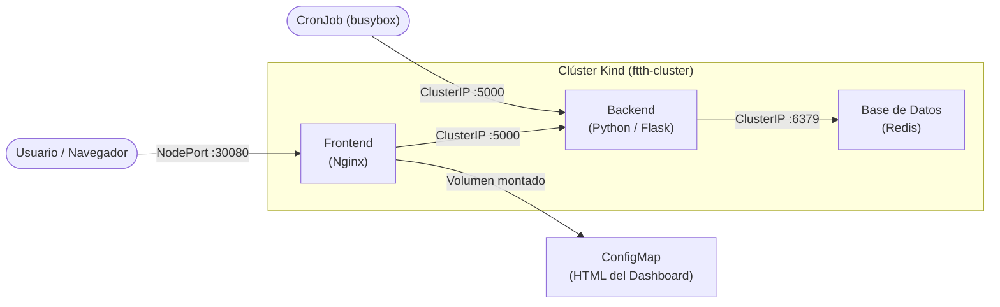

# Proyecto FTTH - Kubernetes PoC

Documentación técnica de un laboratorio de Kubernetes construido sobre un caso de uso real del sector de telecomunicaciones: la gestión y monitoreo de una red de fibra óptica hasta el hogar (FTTH - Fiber To The Home).

Este repositorio es, al mismo tiempo, una **Prueba de Concepto (PoC) funcional** y el principal material de estudio para la certificación **Certified Kubernetes Administrator (CKA)** de la CNCF.

---

## Objetivo del Proyecto

El objetivo no es solo desplegar contenedores; es demostrar dominio sobre los conceptos que evalúa el examen CKA en un entorno reproducible y autocontenido:

- Gestión del ciclo de vida de Workloads (Deployments, CronJobs).
- Networking interno (ClusterIP, NodePort, DNS de Kubernetes).
- Scheduling avanzado (Node Affinity, Resource Requests/Limits).
- Configuración declarativa (ConfigMaps como volúmenes montados).
- Observabilidad (Metrics Server, KubeView).
- Automatización del ciclo de vida del clúster (Kind, Helm, Bash).

---

## Arquitectura de Alto Nivel

La plataforma simula el panel de control de un proveedor de internet. Está compuesta por cuatro componentes principales que se comunican a través de la red interna de Kubernetes:

| Componente | Tecnología | Tipo de Workload | Acceso |
|---|---|---|---|
| Frontend | Nginx Alpine | Deployment (2 réplicas) | NodePort `30080` |
| Backend | Python / Flask | Deployment (2 réplicas) | ClusterIP `5000` |
| Base de Datos | Redis Alpine | Deployment (1 réplica) | ClusterIP `6379` |
| Agente de Monitoreo | BusyBox | CronJob (cada 2 min.) | Interno |

---

## Enfoque de Despliegue

El entorno utiliza dos métodos de despliegue complementarios, lo cual cubre dos dominios críticos del CKA:

**Manifiestos YAML crudos (`k8s/`):** La aplicación principal (Frontend, Backend, Redis, CronJobs y Services) se gestiona mediante manifiestos declarativos organizados por tipo de recurso. Esto simula el flujo de trabajo de `kubectl apply` en entornos reales.

**Helm Chart (`deploy/helm-charts/kubeview`):** La herramienta de visualización KubeView se instala a través de un Helm chart versionado directamente en el repositorio. Esto garantiza reproducibilidad sin dependencias externas en el momento del despliegue.

---

## Prerrequisitos

Para ejecutar este laboratorio, asegúrate de tener instaladas las siguientes herramientas en tu sistema:

| Herramienta | Propósito | Versión mínima recomendada |
|---|---|---|
| `docker` | Runtime de contenedores y base de Kind | 24.x |
| `kind` | Creación del clúster Kubernetes local | 0.22.x |
| `kubectl` | Cliente CLI de Kubernetes | 1.29.x |
| `helm` | Gestor de paquetes para KubeView | 3.x |

Para levantar el entorno completo con un solo comando, consulta la sección [Getting Started](getting-started/index.md).
