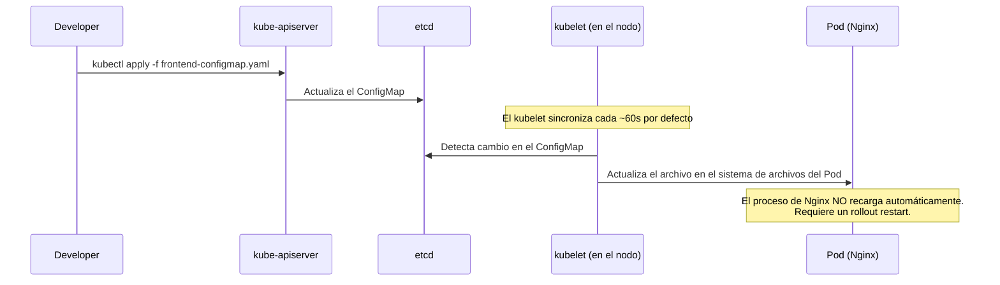

# ConfigMaps

Esta sección documenta los recursos de tipo `ConfigMap` ubicados en `k8s/02-storage/`. Los ConfigMaps son el mecanismo de Kubernetes para **desacoplar la configuración del código**: permiten modificar el comportamiento de las aplicaciones sin reconstruir ni redesplegar imágenes Docker.

## Resumen de ConfigMaps

| Archivo | Nombre | Contenido | Consumido por |
|---|---|---|---|
| `frontend-configmap.yaml` | `ftth-dashboard-html` | HTML + CSS del dashboard FTTH | `ftth-frontend` (montado como volumen) |

!!! info "¿Por qué está en `02-storage/` y no en `02-config/`?"
    En este proyecto, el ConfigMap se ubica en la carpeta `02-storage` porque su función principal es proveer contenido de archivo (el HTML del dashboard), siguiendo el patrón de "almacenamiento de configuración". La numeración asegura que se aplique antes que los Deployments (`03-`) que dependen de él.

---

## Frontend Dashboard ConfigMap

**Archivo:** `k8s/02-storage/frontend-configmap.yaml`

```yaml
apiVersion: v1
kind: ConfigMap
metadata:
  name: ftth-dashboard-html
  labels:
    app: ftth-frontend
data:
  index.html: |
    <!DOCTYPE html>
    <html lang="es">
    <head>
        <meta charset="UTF-8">
        <title>FTTH Network Dashboard</title>
        <style>
            body { font-family: 'Segoe UI', Tahoma, Geneva, Verdana, sans-serif;
                   background-color: #121212; color: #ffffff; margin: 0; padding: 20px; }
            .header { text-align: center; padding: 20px 0; border-bottom: 2px solid #333; }
            .header h1 { margin: 0; color: #00d2ff; letter-spacing: 2px; text-transform: uppercase; }
            .container { display: flex; justify-content: space-around; flex-wrap: wrap; margin-top: 40px; }
            .card { background: #1e1e1e; border-radius: 10px; padding: 30px; width: 250px;
                    text-align: center; box-shadow: 0 4px 15px rgba(0,0,0,0.5); transition: transform 0.3s; }
            .card:hover { transform: translateY(-5px); }
            .status-indicator { width: 20px; height: 20px; border-radius: 50%;
                                display: inline-block; box-shadow: 0 0 10px; }
            .online { background-color: #00ff00; box-shadow: 0 0 15px #00ff00; }
            .value { font-size: 2em; font-weight: bold; margin: 15px 0; color: #00d2ff; }
            .footer { text-align: center; margin-top: 50px; font-size: 0.8em; color: #777; }
        </style>
    </head>
    <body>
        <div class="header">
            <h1>Panel de Control FTTH</h1>
            <p>Monitoreo de Infraestructura de Fibra Óptica</p>
        </div>
        <div class="container">
            <div class="card">
                <h3>Estado OLT Principal</h3>
                <div class="status-indicator online"></div>
                <p>En línea y operando</p>
            </div>
            <div class="card">
                <h3>Clientes Activos (ONTs)</h3>
                <div class="value">1,024</div>
                <p>Nodos sincronizados</p>
            </div>
            <div class="card">
                <h3>Latencia Promedio</h3>
                <div class="value">2.4 ms</div>
                <p>Hacia el Backbone</p>
            </div>
        </div>
        <div class="footer">
            <p>Generado dinámicamente vía Kubernetes ConfigMap | Proyecto CKA</p>
        </div>
    </body>
    </html>
```

---

## Desglose Técnico

### Anatomía del ConfigMap

Un ConfigMap tiene una estructura simple de clave-valor bajo el campo `data:`:

```
data:
  <nombre-del-archivo>: |
    <contenido del archivo>
```

La barra vertical `|` es sintaxis YAML que indica un **bloque literal**: preserva los saltos de línea y la indentación exacta del contenido. Esto es esencial para archivos HTML, scripts de shell o archivos de configuración donde los espacios tienen significado semántico.

En este ConfigMap existe una sola clave (`index.html`) cuyo valor es el HTML completo del dashboard. Cuando se monta como volumen, esta clave se convierte en el archivo `/usr/share/nginx/html/index.html` dentro del contenedor de Nginx.

### Cómo se monta en el Deployment

La conexión entre el ConfigMap y el contenedor se establece en dos pasos dentro del spec del Pod en `frontend-deployment.yaml`:

```yaml
# Paso 1 — Declarar el volumen a nivel del Pod
# Le dice a Kubernetes: "crea un volumen llamado html-volume cuya fuente es el ConfigMap"
volumes:
- name: html-volume
  configMap:
    name: ftth-dashboard-html   # Nombre del ConfigMap a montar

# Paso 2 — Montar el volumen dentro del contenedor
# Le dice a Nginx: "ese volumen aparece en esta ruta de tu sistema de archivos"
volumeMounts:
- name: html-volume
  mountPath: /usr/share/nginx/html
```

El resultado dentro del Pod es el siguiente árbol de archivos:

```
/usr/share/nginx/html/
└── index.html    ← generado desde la clave "index.html" del ConfigMap
```

!!! warning "El mountPath reemplaza el directorio completo"
    Montar un ConfigMap en `/usr/share/nginx/html` **reemplaza todo el contenido original** de ese directorio con las claves del ConfigMap. Si la imagen de Nginx tenía archivos en esa ruta (como `50x.html`), dejarán de existir. Solo existirán los archivos definidos en `data:` del ConfigMap. Si necesitas preservar archivos existentes, usa `subPath` para montar solo un archivo específico:
    ```yaml
    volumeMounts:
    - name: html-volume
      mountPath: /usr/share/nginx/html/index.html
      subPath: index.html   # Monta solo este archivo, sin tocar el resto del directorio
    ```

### Modos de uso de un ConfigMap

Un ConfigMap puede consumirse de tres formas distintas. Este proyecto usa la primera:

=== "Como volumen (este proyecto)"
    Cada clave en `data:` se convierte en un archivo dentro del directorio de montaje.
    ```yaml
    volumes:
    - name: config-vol
      configMap:
        name: ftth-dashboard-html
    volumeMounts:
    - name: config-vol
      mountPath: /usr/share/nginx/html
    ```
    **Ideal para:** archivos de configuración, HTML, CSS, scripts, certificados.

=== "Como variables de entorno"
    Los valores del ConfigMap se inyectan como variables de entorno en el contenedor.
    ```yaml
    envFrom:
    - configMapRef:
        name: mi-configmap
    # O variable por variable:
    env:
    - name: MI_VARIABLE
      valueFrom:
        configMapKeyRef:
          name: mi-configmap
          key: mi-clave
    ```
    **Ideal para:** parámetros de configuración de la aplicación (URLs, timeouts, feature flags).

=== "Como argumento de comando"
    El valor del ConfigMap se usa como argumento en el `command` o `args` del contenedor.
    ```yaml
    command: ["/bin/sh", "-c", "$(MI_VARIABLE)"]
    env:
    - name: MI_VARIABLE
      valueFrom:
        configMapKeyRef:
          name: mi-configmap
          key: mi-script
    ```
    **Ideal para:** scripts de inicialización, comandos parametrizados.

### Propagación de cambios

Cuando se actualiza un ConfigMap montado como volumen, Kubernetes propaga el cambio a los Pods que lo consumen. Sin embargo, este proceso no es inmediato:



!!! tip "Forzar la actualización inmediata"
    Para que Nginx sirva el contenido nuevo inmediatamente tras actualizar el ConfigMap, realiza un rolling restart del Deployment:
    ```bash
    kubectl rollout restart deployment/ftth-frontend
    ```
    Este comando reemplaza los Pods uno a uno usando la estrategia `RollingUpdate`, garantizando cero downtime durante la actualización.

---

## ConfigMaps vs Secrets — Cuándo usar cada uno

Esta es una distinción crítica tanto en la práctica como en el examen CKA:

| Criterio | ConfigMap | Secret |
|---|---|---|
| **Tipo de dato** | Configuración no sensible | Datos sensibles (contraseñas, tokens, certificados) |
| **Almacenamiento en etcd** | Texto plano | Base64 (no cifrado por defecto, pero aislado) |
| **Visibilidad** | Visible con `kubectl get configmap` | Ocultado con `kubectl get secret` (requiere `-o yaml` para ver) |
| **Ejemplos** | HTML, URLs, parámetros de app | Contraseñas de BBDD, API keys, tokens OAuth |
| **Cifrado en reposo** | No | Opcional con `EncryptionConfiguration` |

!!! warning "Base64 no es cifrado"
    Los Secrets de Kubernetes se almacenan en `etcd` codificados en Base64, que es un formato de **codificación**, no de **cifrado**. Cualquier persona con acceso a `etcd` puede decodificarlos trivialmente con `echo <valor> | base64 -d`. Para cifrado real en reposo, se necesita configurar `EncryptionConfiguration` en el API Server o usar soluciones externas como HashiCorp Vault o AWS KMS.

---

## Instrucciones de Operación

### Aplicar el ConfigMap

```bash
# El ConfigMap debe aplicarse ANTES que el Deployment del Frontend
kubectl apply -f k8s/02-storage/frontend-configmap.yaml
```

### Verificar el estado

```bash
# Listar todos los ConfigMaps del namespace
kubectl get configmaps

# Ver el contenido completo del ConfigMap
kubectl describe configmap ftth-dashboard-html

# Ver el contenido en formato YAML (incluye el HTML completo)
kubectl get configmap ftth-dashboard-html -o yaml
```

### Actualizar el contenido del dashboard

Para modificar el HTML (por ejemplo, cambiar el número de clientes activos de `1,024` a `2,048`):

```bash
# Editar directamente el archivo local y reaplicar
kubectl apply -f k8s/02-storage/frontend-configmap.yaml

# Forzar actualización inmediata en los Pods
kubectl rollout restart deployment/ftth-frontend

# Monitorear el progreso del rollout
kubectl rollout status deployment/ftth-frontend
```

### Verificar que el archivo está montado correctamente en el Pod

```bash
# Entrar al contenedor de Nginx
kubectl exec -it deployment/ftth-frontend -- sh

# Verificar el archivo montado
ls -la /usr/share/nginx/html/
cat /usr/share/nginx/html/index.html
```

### Crear un ConfigMap desde un archivo local (forma imperativa)

```bash
# Alternativa al YAML declarativo (útil para pruebas rápidas)
kubectl create configmap ftth-dashboard-html \
  --from-file=index.html=./src/frontend/index.html

# Ver el resultado
kubectl get configmap ftth-dashboard-html -o yaml
```

### Debugging

```bash
# Si el Pod de Nginx no arranca y está en Pending o Error,
# verificar que el ConfigMap existe antes de que el Pod lo necesite
kubectl get configmap ftth-dashboard-html

# Ver eventos del Pod para detectar errores de montaje
kubectl describe pod -l app=ftth-frontend | grep -A 10 "Events"

# Si aparece: "MountVolume.SetUp failed for volume ... configmap not found"
# significa que el ConfigMap no fue aplicado antes que el Deployment
kubectl apply -f k8s/02-storage/frontend-configmap.yaml
kubectl rollout restart deployment/ftth-frontend
```

!!! warning "Síntoma: Nginx sirve la página por defecto en lugar del dashboard"
    Si al acceder a `http://localhost:30080` ves la página de bienvenida de Nginx (`Welcome to nginx!`) en lugar del panel FTTH, el ConfigMap no está montado correctamente. Verifica:
    ```bash
    # 1. Confirmar que el ConfigMap existe
    kubectl get configmap ftth-dashboard-html

    # 2. Confirmar que el volumen está declarado en el Deployment
    kubectl describe deployment ftth-frontend | grep -A 5 "Volumes"

    # 3. Confirmar que el archivo está dentro del Pod
    kubectl exec -it deployment/ftth-frontend -- ls /usr/share/nginx/html/
    ```
    Si el directorio está vacío o falta `index.html`, el problema es de sincronización. Reinicia el Deployment.
