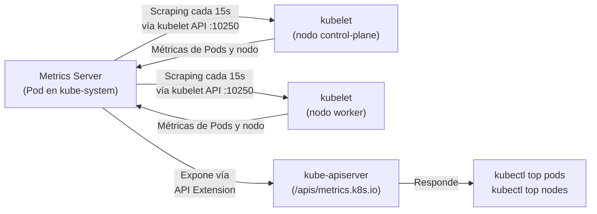

# Metrics Server

Esta sección documenta el manifiesto ubicado en `k8s/06-metrics/metrics-server.yaml`. El Metrics Server es un componente de infraestructura del clúster, no de la aplicación FTTH. Habilita la API de métricas de Kubernetes, lo que permite usar `kubectl top` para observar el consumo real de CPU y memoria de los Pods y nodos.

!!! info "Namespace: `kube-system`"
    A diferencia de los Workloads de la aplicación (que viven en el namespace `default`), el Metrics Server se instala en el namespace `kube-system`. Este namespace está reservado para los componentes del sistema de Kubernetes (CoreDNS, kube-proxy, etc.). Aislar los componentes de infraestructura en `kube-system` es una práctica estándar de seguridad y organización.

---

## Por qué existe el Metrics Server

Kubernetes no viene con capacidad de métricas habilitada por defecto. El API Server tiene un endpoint de métricas (`/apis/metrics.k8s.io`) que está registrado pero vacío hasta que un proveedor de métricas lo implementa.

El Metrics Server es ese proveedor. Su ciclo de trabajo es:



Sin el Metrics Server, `kubectl top` devuelve:
```
error: Metrics API not available
```

!!! warning "Metrics Server almacena solo métricas en tiempo real"
    El Metrics Server mantiene únicamente los valores más recientes de CPU y memoria. **No almacena histórico**. Para métricas históricas y dashboards de tendencia, se necesitan soluciones como Prometheus + Grafana.

---

## Desglose Técnico: Los 8 Recursos del Manifiesto

El manifiesto es un fichero multi-documento YAML (separado por `---`). Contiene 8 recursos que en conjunto implementan el ciclo de seguridad completo de RBAC + el Deployment + el registro en la API.

### 1. ServiceAccount

```yaml
apiVersion: v1
kind: ServiceAccount
metadata:
  name: metrics-server
  namespace: kube-system
```

**¿Para qué sirve un ServiceAccount?**

En Kubernetes, todo Pod necesita una identidad para interactuar con el API Server. El `ServiceAccount` es esa identidad. Sin uno explícito, el Pod usaría el ServiceAccount `default` del namespace, que no tiene los permisos necesarios.

El Metrics Server necesita hacer llamadas a la kubelet API de cada nodo para obtener métricas. Sin su propio ServiceAccount con permisos específicos, el API Server rechazaría esas llamadas con `403 Forbidden`.

!!! info "El ServiceAccount es solo la identidad — los permisos vienen después"
    Crear el ServiceAccount solo establece "quién soy". Los recursos RBAC que siguen (ClusterRoles y Bindings) definen "qué puedo hacer".

---

### 2 y 3. ClusterRoles — Definición de permisos

Un `ClusterRole` define un conjunto de permisos sobre recursos de la API de Kubernetes. A diferencia de un `Role` (que aplica solo a un namespace), el `ClusterRole` aplica a todos los namespaces del clúster.

#### ClusterRole: `system:aggregated-metrics-reader`

```yaml
apiVersion: rbac.authorization.k8s.io/v1
kind: ClusterRole
metadata:
  name: system:aggregated-metrics-reader
  labels:
    rbac.authorization.k8s.io/aggregate-to-admin: "true"
    rbac.authorization.k8s.io/aggregate-to-edit: "true"
    rbac.authorization.k8s.io/aggregate-to-view: "true"
rules:
- apiGroups:
  - metrics.k8s.io
  resources:
  - pods
  - nodes
  verbs:
  - get
  - list
  - watch
```

Este ClusterRole permite que usuarios con roles `admin`, `edit` o `view` puedan **leer** métricas de Pods y nodos. Los labels `aggregate-to-*` son el mecanismo de **ClusterRole Aggregation**: automáticamente fusionan estos permisos en los roles estándar de Kubernetes sin modificarlos directamente.

#### ClusterRole: `system:metrics-server`

```yaml
apiVersion: rbac.authorization.k8s.io/v1
kind: ClusterRole
metadata:
  name: system:metrics-server
rules:
- apiGroups: [""]
  resources: ["nodes/metrics"]
  verbs: ["get"]
- apiGroups: [""]
  resources: ["pods", "nodes"]
  verbs: ["get", "list", "watch"]
```

Este ClusterRole es el permiso operativo del Metrics Server:
- Puede leer `nodes/metrics` (el endpoint interno del kubelet que expone métricas de cAdvisor).
- Puede listar y observar Pods y Nodes (necesario para asociar métricas con nombres de recursos).

**Anatomía de una regla RBAC:**

| Campo | Valor en este ejemplo | Significado |
|---|---|---|
| `apiGroups` | `""` (core) o `metrics.k8s.io` | Grupo de la API donde vive el recurso |
| `resources` | `nodes`, `pods`, `nodes/metrics` | El tipo de objeto sobre el que aplica el permiso |
| `verbs` | `get`, `list`, `watch` | Las acciones permitidas |

!!! tip "Los verbos de RBAC y su equivalente HTTP"
    | Verbo K8s | Acción | HTTP |
    |---|---|---|
    | `get` | Leer un recurso específico | GET |
    | `list` | Listar todos los recursos del tipo | GET (colección) |
    | `watch` | Suscribirse a cambios en tiempo real | GET (streaming) |
    | `create` | Crear un nuevo recurso | POST |
    | `update` | Reemplazar un recurso existente | PUT |
    | `patch` | Modificar parcialmente un recurso | PATCH |
    | `delete` | Eliminar un recurso | DELETE |

---

### 4 y 5. RoleBinding y ClusterRoleBindings — Asignación de permisos

Los Bindings son el "pegamento" que une una identidad (ServiceAccount) con un conjunto de permisos (Role/ClusterRole).

#### RoleBinding: `metrics-server-auth-reader`

```yaml
apiVersion: rbac.authorization.k8s.io/v1
kind: RoleBinding
metadata:
  name: metrics-server-auth-reader
  namespace: kube-system
roleRef:
  kind: Role
  name: extension-apiserver-authentication-reader
subjects:
- kind: ServiceAccount
  name: metrics-server
  namespace: kube-system
```

Permite al Metrics Server leer el ConfigMap `extension-apiserver-authentication` en `kube-system`. Este ConfigMap contiene los certificados de CA que el Metrics Server necesita para autenticarse con el API Server como una **API Extension**.

#### ClusterRoleBinding: `metrics-server:system:auth-delegator`

Permite al Metrics Server delegar la autenticación de peticiones entrantes al API Server principal. Es parte del mecanismo de **API Aggregation** que permite registrar APIs personalizadas.

#### ClusterRoleBinding: `system:metrics-server`

```yaml
apiVersion: rbac.authorization.k8s.io/v1
kind: ClusterRoleBinding
metadata:
  name: system:metrics-server
roleRef:
  kind: ClusterRole
  name: system:metrics-server
subjects:
- kind: ServiceAccount
  name: metrics-server
  namespace: kube-system
```

El binding principal. Asigna el ClusterRole `system:metrics-server` (los permisos de lectura de nodos y métricas) al ServiceAccount `metrics-server`. Sin este binding, el Pod del Metrics Server no podría consultar el kubelet de ningún nodo.

---

### 6. Service — Exposición HTTPS interna

```yaml
apiVersion: v1
kind: Service
metadata:
  name: metrics-server
  namespace: kube-system
spec:
  ports:
  - appProtocol: https
    name: https
    port: 443
    protocol: TCP
    targetPort: https
  selector:
    k8s-app: metrics-server
```

El Metrics Server expone su API sobre **HTTPS en el puerto 443**. El kube-apiserver se conecta a este Service para obtener métricas cuando se llama a `kubectl top`. El campo `appProtocol: https` es una anotación informativa que indica el protocolo de la aplicación, usada por Ingress Controllers y service meshes.

---

### 7. Deployment — El componente central

```yaml
apiVersion: apps/v1
kind: Deployment
metadata:
  name: metrics-server
  namespace: kube-system
spec:
  strategy:
    rollingUpdate:
      maxUnavailable: 0      # Nunca bajes a cero réplicas durante un update
  template:
    spec:
      containers:
      - args:
        - --cert-dir=/tmp
        - --secure-port=10250
        - --kubelet-preferred-address-types=InternalIP,ExternalIP,Hostname
        - --kubelet-use-node-status-port
        - --metric-resolution=15s
        - --kubelet-insecure-tls                    # Parche para Kind
        image: registry.k8s.io/metrics-server/metrics-server:v0.8.1
        livenessProbe:
          httpGet:
            path: /livez
            port: https
            scheme: HTTPS
          periodSeconds: 10
          failureThreshold: 3
        readinessProbe:
          httpGet:
            path: /readyz
            port: https
            scheme: HTTPS
          initialDelaySeconds: 20
          periodSeconds: 10
          failureThreshold: 3
        resources:
          requests:
            cpu: 100m
            memory: 200Mi
        securityContext:
          allowPrivilegeEscalation: false
          capabilities:
            drop: ["ALL"]
          readOnlyRootFilesystem: true
          runAsNonRoot: true
          runAsUser: 1000
          seccompProfile:
            type: RuntimeDefault
        volumeMounts:
        - mountPath: /tmp
          name: tmp-dir
      nodeSelector:
        kubernetes.io/os: linux
      priorityClassName: system-cluster-critical
      serviceAccountName: metrics-server
      volumes:
      - emptyDir: {}
        name: tmp-dir
```

#### El argumento crítico: `--kubelet-insecure-tls`

Este es el único argumento que se **añadió al manifiesto original** para hacerlo compatible con Kind:

```
--kubelet-insecure-tls
```

En un clúster real (kubeadm, EKS, GKE), los nodos tienen certificados TLS firmados por la CA del clúster. El Metrics Server puede verificar su autenticidad antes de conectarse.

En Kind, los nodos son contenedores Docker con certificados **auto-firmados** que no forman parte de la CA del clúster. Sin este flag, el Metrics Server rechazaría la conexión al kubelet con un error de validación TLS y nunca obtendría métricas.

!!! warning "Solo para entornos locales de desarrollo"
    `--kubelet-insecure-tls` deshabilita la verificación del certificado del kubelet. En producción, esto sería una vulnerabilidad de seguridad (susceptible a ataques man-in-the-middle). Este flag es exclusivo de entornos Kind, Minikube y similares.

#### LivenessProbe y ReadinessProbe — Auto-healing y tráfico seguro

El Metrics Server implementa ambos tipos de probe. Esta es la primera vez en el proyecto que aparecen, y son conceptos clave del CKA:

```yaml
livenessProbe:
  httpGet:
    path: /livez       # Endpoint que responde 200 si el proceso está vivo
    port: https
    scheme: HTTPS
  periodSeconds: 10    # Verificar cada 10 segundos
  failureThreshold: 3  # Reiniciar el Pod tras 3 fallos consecutivos

readinessProbe:
  httpGet:
    path: /readyz      # Endpoint que responde 200 si está listo para tráfico
    port: https
    scheme: HTTPS
  initialDelaySeconds: 20  # Esperar 20s antes del primer chequeo (tiempo de inicio)
  periodSeconds: 10
  failureThreshold: 3
```

| Probe | Pregunta que responde | Consecuencia del fallo |
|---|---|---|
| `livenessProbe` | "¿Está el proceso vivo?" | El `kubelet` **reinicia el contenedor** |
| `readinessProbe` | "¿Puede recibir tráfico ahora?" | El Service **elimina el Pod de los endpoints** (no le envía tráfico) |

El `initialDelaySeconds: 20` de la readinessProbe es fundamental: el Metrics Server tarda varios segundos en inicializar su API y conectarse a los kubelets. Sin este delay, la probe fallaría inmediatamente y el Pod entraría en un ciclo de `CrashLoopBackOff` aunque en realidad esté funcionando correctamente.

#### SecurityContext — Hardening del contenedor

```yaml
securityContext:
  allowPrivilegeEscalation: false  # El proceso no puede obtener más privilegios de los que tiene
  capabilities:
    drop: ["ALL"]                  # Elimina todas las Linux capabilities del contenedor
  readOnlyRootFilesystem: true     # El sistema de archivos raíz es solo lectura
  runAsNonRoot: true               # El proceso no puede correr como root (UID 0)
  runAsUser: 1000                  # Corre con el UID 1000 (usuario sin privilegios)
  seccompProfile:
    type: RuntimeDefault           # Aplica el perfil seccomp del runtime (restricción de syscalls)
```

Este es el conjunto de configuraciones de seguridad más completo del proyecto. Implementa el principio de **mínimo privilegio** a nivel de contenedor:

- Si el proceso del Metrics Server fuera comprometido, no podría escalar privilegios.
- No puede escribir en el sistema de archivos (solo en `/tmp`, que es el volumen `emptyDir` montado).
- No tiene acceso a syscalls del kernel que no sean estrictamente necesarias.

#### `priorityClassName: system-cluster-critical`

Esta clase de prioridad le dice al scheduler de Kubernetes que el Metrics Server es un componente crítico del sistema. En situaciones de presión de recursos (nodo lleno), el scheduler puede **desalojar** Pods de menor prioridad para hacer espacio al Metrics Server, garantizando que el monitoreo del clúster nunca se interrumpa.

---

### 8. APIService — Registro en la API de Kubernetes

```yaml
apiVersion: apiregistration.k8s.io/v1
kind: APIService
metadata:
  name: v1beta1.metrics.k8s.io
spec:
  group: metrics.k8s.io
  groupPriorityMinimum: 100
  insecureSkipTLSVerify: true
  service:
    name: metrics-server
    namespace: kube-system
  version: v1beta1
  versionPriority: 100
```

Este es el recurso que "registra" al Metrics Server como una extensión del API Server de Kubernetes. Es lo que hace que el endpoint `/apis/metrics.k8s.io/v1beta1` exista y funcione.

Cuando ejecutas `kubectl top`, el API Server recibe la petición, ve que `metrics.k8s.io` está registrado como una API externa, y **delega la petición** al Service `metrics-server` en `kube-system`. El Metrics Server responde con los valores más recientes que tiene de sus scrapings al kubelet.

---

## Instrucciones de Operación

### Aplicar el Metrics Server

```bash
kubectl apply -f k8s/06-metrics/metrics-server.yaml
```

### Verificar que el Metrics Server está operativo

```bash
# Ver el Pod del Metrics Server en kube-system
kubectl get pods -n kube-system -l k8s-app=metrics-server

# El Pod debe estar en estado Running y READY 1/1
# Si está en 0/1 Ready, la readinessProbe aún no ha pasado (espera 20-30s)
```

### Verificar que la API de métricas está registrada

```bash
kubectl get apiservice v1beta1.metrics.k8s.io
```

El campo `AVAILABLE` debe ser `True`. Si muestra `False`, el Metrics Server aún no está listo o hay un problema de conectividad con el kubelet.

### Usar las métricas

```bash
# Ver consumo de CPU y RAM de todos los Pods del namespace default
kubectl top pods

# Ver consumo de todos los Pods de todos los namespaces
kubectl top pods -A

# Ver consumo de CPU y RAM por nodo
kubectl top nodes

# Ver los Pods que más CPU consumen (ordenados)
kubectl top pods --sort-by=cpu

# Ver los Pods que más memoria consumen
kubectl top pods --sort-by=memory
```

Output esperado:

```
NAME                             CPU(cores)   MEMORY(bytes)
ftth-backend-7d9f8b-x4k2p        3m           42Mi
ftth-backend-7d9f8b-r8t1q        2m           40Mi
ftth-frontend-6c8d9b-p2m7s       1m           8Mi
ftth-frontend-6c8d9b-w9n3k       1m           7Mi
ftth-redis-5b7f9c-k4p8r          4m           6Mi
```

### Debugging

```bash
# Ver los logs del Metrics Server
kubectl logs -n kube-system -l k8s-app=metrics-server --tail=50

# Ver eventos del namespace kube-system relacionados con el Metrics Server
kubectl get events -n kube-system --sort-by=.lastTimestamp | grep metrics

# Verificar el estado de la API Extension
kubectl describe apiservice v1beta1.metrics.k8s.io
```

!!! warning "Síntoma: `kubectl top` devuelve error tras instalar el Metrics Server"
    Si `kubectl top` sigue fallando después de aplicar el manifiesto, espera 30-60 segundos y vuelve a intentarlo. El Metrics Server necesita completar su primer ciclo de scraping (15 segundos por configuración) antes de tener datos que devolver.

    Si el error persiste, verifica:
    ```bash
    # ¿El Pod está en Running?
    kubectl get pods -n kube-system -l k8s-app=metrics-server

    # ¿La readinessProbe pasó? (debe estar READY 1/1)
    kubectl describe pod -n kube-system -l k8s-app=metrics-server | grep -A 5 "Readiness"

    # ¿Hay errores TLS en los logs?
    kubectl logs -n kube-system -l k8s-app=metrics-server | grep -i "tls\|error\|certificate"
    ```
    Si los logs muestran errores TLS, confirma que el argumento `--kubelet-insecure-tls` está presente en el manifiesto.
