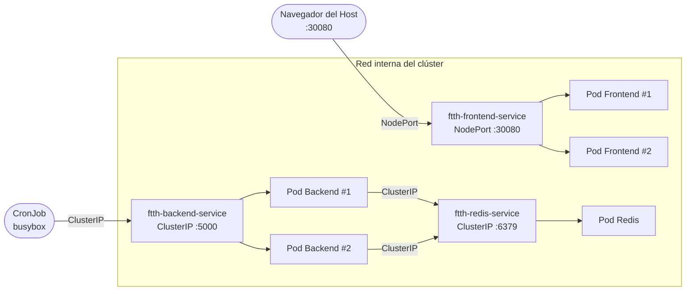

# Services

Esta sección documenta los tres recursos de tipo `Service` ubicados en `k8s/03-services/`. Los Services son la capa de red de Kubernetes: resuelven el problema fundamental de que las IPs de los Pods son **efímeras** (cambian cada vez que un Pod se reinicia) y proporcionan un punto de acceso estable y con balanceo de carga hacia los Workloads.

## Resumen de Services

| Archivo | Nombre | Tipo | Puerto | Accesible desde |
|---|---|---|---|---|
| `frontend-service.yaml` | `ftth-frontend-service` | `NodePort` | `30080` | Host local y red local |
| `backend-service.yaml` | `ftth-backend-service` | `ClusterIP` | `5000` | Solo dentro del clúster |
| `redis-service.yaml` | `ftth-redis-service` | `ClusterIP` | `6379` | Solo dentro del clúster |

El mapa de red del clúster queda así:



!!! tip "Para el desglose arquitectónico de cada Service"
    Esta sección es referencia rápida de manifiestos. Para la explicación de por qué se eligió cada tipo, consulta la sección [Arquitectura](../architecture/index.md).

---

## Frontend Service — NodePort

**Archivo:** `k8s/03-services/frontend-service.yaml`

```yaml
apiVersion: v1
kind: Service
metadata:
  name: ftth-frontend-service
spec:
  type: NodePort
  selector:
    app: ftth-frontend
  ports:
    - port: 80
      targetPort: 80
      nodePort: 30080
```

**Por qué `NodePort` aquí y en ningún otro lugar:**

El Frontend es el único componente que necesita ser accesible desde fuera del clúster — es la interfaz de usuario. `NodePort` abre un puerto estático en **todos los nodos del clúster** y redirige el tráfico entrante hacia los Pods seleccionados.

El flujo de una petición es:

```
Navegador → localhost:30080 → Nodo Kind → Service (NodePort) → Pod Nginx (puerto 80)
```

Los tres campos de `ports` tienen roles distintos:

| Campo | Valor | Rol |
|---|---|---|
| `nodePort` | `30080` | Puerto abierto en el nodo (accesible desde el host) |
| `port` | `80` | Puerto del Service dentro del clúster |
| `targetPort` | `80` | Puerto donde escucha el contenedor (Nginx) |

!!! info "Rango válido para NodePort"
    Kubernetes solo permite NodePorts en el rango **30000–32767**. Este rango está reservado para evitar conflictos con puertos del sistema. Si intentas usar un valor fuera de este rango, el API Server rechazará el manifiesto.

!!! warning "NodePort en producción"
    `NodePort` es adecuado para laboratorios y entornos de desarrollo. En producción, se utiliza un `Service` de tipo `LoadBalancer` (que provisiona automáticamente un balanceador de carga en el cloud provider) o un `Ingress` Controller para gestionar el tráfico HTTP/HTTPS con reglas de enrutamiento avanzadas.

**Cómo funciona el balanceo de carga automático:**

El Frontend tiene `replicas: 2`. El Service distribuye las peticiones entrantes entre los dos Pods del Frontend usando **round-robin** por defecto. Esto es transparente para el usuario: siempre accede a `localhost:30080` y el Service decide qué Pod responde.

---

## Backend Service — ClusterIP

**Archivo:** `k8s/03-services/backend-service.yaml`

```yaml
apiVersion: v1
kind: Service
metadata:
  name: ftth-backend-service
spec:
  type: ClusterIP
  selector:
    app: ftth-backend
  ports:
    - port: 5000
      targetPort: 5000
```

**Por qué `ClusterIP`:**

El Backend es un microservicio interno. No tiene razón para estar expuesto al mundo exterior. `ClusterIP` es el tipo de Service más seguro y el predeterminado en Kubernetes: crea una IP virtual accesible **únicamente desde dentro del clúster**.

Los consumidores de este Service son:
- El **CronJob** (`busybox`), que llama a `http://ftth-backend-service:5000/status` cada 2 minutos.
- En una evolución futura del proyecto, el **Frontend** podría consumir la API del Backend via JavaScript para mostrar datos dinámicos.

**El rol de `selector`:**

```yaml
selector:
  app: ftth-backend
```

El selector es el mecanismo que conecta el Service con los Pods. Kubernetes mantiene en tiempo real una lista de **Endpoints** (IPs de Pods) que coinciden con ese selector. Si un Pod falla y es reemplazado, el nuevo Pod tiene la misma label y el Service lo incluye automáticamente en la rotación, sin intervención manual.

```bash
# Verificar los endpoints activos del Service en cualquier momento
kubectl get endpoints ftth-backend-service
```

Output esperado con 2 réplicas activas:

```
NAME                    ENDPOINTS                         AGE
ftth-backend-service    10.244.1.5:5000,10.244.1.6:5000   10m
```

!!! info "¿Qué pasa si todos los Pods de un Service fallan?"
    Si todos los Pods del Backend caen, `kubectl get endpoints` mostrará `<none>` en la columna ENDPOINTS. Cualquier intento de conexión al Service resultará en un timeout o `Connection refused`. Este estado se autocorrige cuando el Deployment crea Pods de reemplazo.

---

## Redis Service — ClusterIP

**Archivo:** `k8s/03-services/redis-service.yaml`

```yaml
apiVersion: v1
kind: Service
metadata:
  name: ftth-redis-service
spec:
  type: ClusterIP
  selector:
    app: ftth-redis
  ports:
    - port: 6379
      targetPort: 6379
```

**Por qué `ClusterIP` es crítico aquí:**

Redis es la capa de datos más sensible del sistema. Exponer el puerto `6379` al exterior sería una vulnerabilidad crítica: Redis, por defecto, no requiere autenticación y aceptaría cualquier conexión externa.

El único consumidor legítimo de Redis es el Backend Python, que se conecta usando el DNS interno `ftth-redis-service:6379`. Ningún proceso externo al clúster puede alcanzar este Service.

!!! warning "Redis expuesto a internet = vector de ataque"
    Hay instancias de Redis mal configuradas en internet que son explotadas activamente. El patrón correcto es siempre: `ClusterIP` + autenticación (`requirepass`) + acceso solo desde los Pods que lo necesitan (idealmente reforzado con `NetworkPolicy`).

**El nombre del Service como hostname de DNS:**

El nombre `ftth-redis-service` es mucho más que un identificador de Kubernetes. El componente `CoreDNS` del clúster lo registra como un **hostname resolvible** dentro de la red interna. Por eso el código Python puede hacer:

```python
redis_host = os.getenv("REDIS_HOST", "ftth-redis-service")
cache = redis.Redis(host=redis_host, port=6379)
```

Y `ftth-redis-service` se resuelve correctamente a la IP del Pod de Redis, sin que el desarrollador necesite conocer dicha IP.

El FQDN (Fully Qualified Domain Name) completo en Kubernetes es:

```
ftth-redis-service.default.svc.cluster.local
```

Donde `default` es el namespace y `cluster.local` es el dominio del clúster. La versión corta (`ftth-redis-service`) funciona porque los Pods del mismo namespace heredan el sufijo DNS automáticamente.

---

## Comparativa de tipos de Service

| Tipo | Alcance | Caso de uso en este proyecto | Caso de uso en producción |
|---|---|---|---|
| `ClusterIP` | Solo dentro del clúster | Backend, Redis | Servicios internos, microservicios |
| `NodePort` | Host + red local | Frontend (dashboard) | Laboratorios, desarrollo local |
| `LoadBalancer` | Internet (requiere cloud) | No utilizado | APIs públicas en AWS/GCP/Azure |
| `ExternalName` | Alias DNS externo | No utilizado | Apuntar a servicios externos (ej. RDS) |
| `Headless` (ClusterIP: None) | DNS directo a Pods | No utilizado | StatefulSets, Redis Cluster |

---

## Instrucciones de Operación

### Aplicar todos los Services

```bash
kubectl apply -f k8s/03-services/
```

### Verificar el estado de los Services

```bash
# Ver todos los Services con su tipo, ClusterIP y puerto
kubectl get services

# Vista detallada de un Service específico
kubectl describe service ftth-frontend-service
```

Output esperado:

```
NAME                    TYPE        CLUSTER-IP      EXTERNAL-IP   PORT(S)          AGE
ftth-backend-service    ClusterIP   10.96.45.123    <none>        5000/TCP         5m
ftth-frontend-service   NodePort    10.96.78.234    <none>        80:30080/TCP     5m
ftth-redis-service      ClusterIP   10.96.12.89     <none>        6379/TCP         5m
```

### Verificar los endpoints de un Service

```bash
# Ver qué Pods están actualmente registrados como endpoints
kubectl get endpoints

# Output detallado con IPs y puertos
kubectl describe endpoints ftth-backend-service
```

### Probar la conectividad entre Services desde dentro del clúster

```bash
# Probar el Frontend Service (desde un Pod temporal)
kubectl run test --image=curlimages/curl --rm -it --restart=Never -- \
  curl -s http://ftth-frontend-service:80

# Probar el Backend Service por DNS
kubectl run test --image=curlimages/curl --rm -it --restart=Never -- \
  curl -s http://ftth-backend-service:5000/status

# Probar el Redis Service por DNS
kubectl run test --image=redis:alpine --rm -it --restart=Never -- \
  redis-cli -h ftth-redis-service -p 6379 PING
```

### Acceso al Frontend desde el host

```bash
# Verificar el NodePort activo
kubectl get service ftth-frontend-service

# Acceder via curl desde el terminal del host
curl http://localhost:30080

# O directamente desde el navegador:
# http://localhost:30080
```

### Debugging de conectividad

```bash
# Si un Pod no puede alcanzar a otro Service, verificar que CoreDNS está operativo
kubectl get pods -n kube-system -l k8s-app=kube-dns

# Resolver el DNS de un Service desde dentro de un Pod
kubectl run dns-test --image=busybox --rm -it --restart=Never -- \
  nslookup ftth-backend-service

# Ver los eventos de un Service (útil para detectar problemas de selector)
kubectl describe service ftth-backend-service | grep -A 10 "Events"
```

!!! warning "Síntoma: `Connection refused` entre Pods"
    Si un Pod no puede alcanzar a otro via el nombre del Service, las causas más comunes son:

    1. **El Pod destino no está corriendo** — verificar con `kubectl get pods`.
    2. **El selector del Service no coincide con los labels del Pod** — verificar con `kubectl get endpoints <nombre-del-service>`. Si muestra `<none>`, el selector está mal.
    3. **CoreDNS no está operativo** — verificar con `kubectl get pods -n kube-system`.
