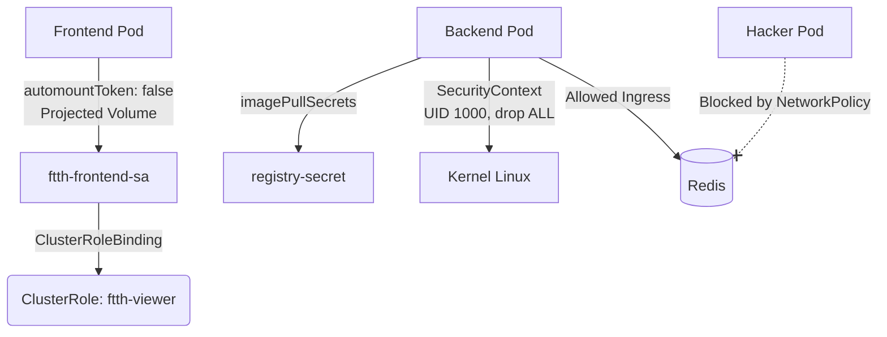

# Endurecimiento y Extensión de Arquitectura

## Visión General

Esta sección documenta la implementación de configuraciones avanzadas aplicadas a la arquitectura del proyecto FTTH. Se introducen conceptos de control de acceso (RBAC), seguridad de contexto, aislamiento de red (Zero-Trust) y extensión de la API nativa de Kubernetes mediante Custom Resources.

| Recurso | Nombre | Propósito |
|---|---|---|
| `ServiceAccount` | `ftth-frontend-sa` | Identidad segura para los pods del frontend. |
| `ClusterRole` | `ftth-viewer` | Permisos globales de solo lectura (pods, services, nodes). |
| `ClusterRoleBinding` | `frontend-viewer-binding` | Vincula el ServiceAccount con los permisos del ClusterRole. |
| `Secret` | `ftth-registry-secret` | Simula credenciales para autenticarse contra un Docker Registry privado. |
| `NetworkPolicy` | `redis-networkpolicy` | Bloquea todo el tráfico a Redis excepto el proveniente del Backend. |
| `CustomResourceDefinition` | `oltprofiles.infrastructure.ftth.com` | Extiende la API para gestionar perfiles OLT del negocio FTTH. |



---

## Desglose Técnico

### Control de Identidad y Permisos — `k8s/00-rbac/frontend-sa.yaml`

```yaml
apiVersion: v1
kind: ServiceAccount
metadata:
  name: ftth-frontend-sa
  namespace: default
automountServiceAccountToken: false
---
apiVersion: rbac.authorization.k8s.io/v1
kind: ClusterRole
metadata:
  name: ftth-viewer
rules:
- apiGroups: [""]
  resources: ["pods", "services", "nodes"]
  verbs: ["get", "watch", "list"]
---
apiVersion: rbac.authorization.k8s.io/v1
kind: ClusterRoleBinding
metadata:
  name: frontend-viewer-binding
subjects:
- kind: ServiceAccount
  name: ftth-frontend-sa
  namespace: default
roleRef:
  kind: ClusterRole
  name: ftth-viewer
  apiGroup: rbac.authorization.k8s.io
```

#### ¿Por qué `automountServiceAccountToken: false`?
Por defecto, Kubernetes inyecta el token de seguridad del API Server en cada pod que se levanta. Si un atacante compromete el pod de Nginx, podría usar ese token para hablar con el clúster. Al deshabilitarlo a nivel de ServiceAccount y Pod, aseguramos que las credenciales solo se inyecten donde explícitamente se requieran mediante volúmenes proyectados.

### Inyección Segura de Credenciales — `k8s/02-deployments/frontend-deployment.yaml`

```yaml
    spec:
       serviceAccountName: ftth-frontend-sa
       automountServiceAccountToken: false
       containers:
       # ...
       # --- Montamos el volumen en la ruta de Nginx ---
         volumeMounts:
         - mountPath: /var/run/secrets/kubernetes.io/serviceaccount/
           name: token
           readOnly: true
       # ...
       # --- Definimos de dónde sale el volumen ---
       volumes:
       - name: token
         projected:
           sources:
           - serviceAccountToken:
               path: token
```

!!! info "Projected Volumes"
    En el `frontend-deployment.yaml`, el token se monta explícitamente usando la técnica de `projected` volume, forzando su ruta física exacta (`/var/run/secrets/kubernetes.io/serviceaccount/`).

### Restricciones de Contexto y Registry — `k8s/02-deployments/backend-deployment.yaml`

```yaml
    spec:
       imagePullSecrets:
       - name: ftth-registry-secret
       securityContext:
         runAsUser: 1000
         runAsGroup: 3000
         fsGroup: 2000
       containers:
       - name: python-api
         image: ftth-backend:v1
         securityContext:
           allowPrivilegeEscalation: false
           capabilities:
             drop:
             - ALL
```

#### ¿Por qué `runAsUser: 1000` y `drop: ["ALL"]`?
Por defecto, los procesos dentro de un contenedor se ejecutan como el usuario `root` (UID 0). Si la aplicación es vulnerada, el atacante obtiene privilegios de administrador. Al forzar un usuario no privilegiado (UID 1000), bloquear la escalación de privilegios (`allowPrivilegeEscalation: false`) y eliminar todas las `capabilities` del kernel, mitigamos el riesgo de que un atacante pueda escapar del contenedor hacia el nodo host.

### Aislamiento de Red — `k8s/04-security/redis-networkpolicy.yaml`

```yaml
apiVersion: networking.k8s.io/v1
kind: NetworkPolicy
metadata:
  name: redis-networkpolicy
  namespace: default
spec:
  podSelector:
    matchLabels:
      app: ftth-redis
  policyTypes:
  - Ingress
  - Egress
  ingress:
  - from:
    - podSelector:
        matchLabels:
          app: ftth-backend
    ports:
    - protocol: TCP
      port: 6379
  egress:
  - ports:
    - port: 53
      protocol: UDP
    - port: 53
      protocol: TCP
```

#### ¿Por qué especificamos el puerto 53 en Egress?
Al habilitar un `NetworkPolicy` con políticas de `Egress` sobre un pod, este se vuelve ciego hacia el exterior, lo que incluye el tráfico al servidor DNS interno del clúster (CoreDNS). Abrir explícitamente el puerto 53 (TCP/UDP) es mandatorio para que el pod pueda resolver nombres de servicio, previniendo errores de conectividad subyacentes.

### Custom Resource Definitions — `k8s/07-crds/oltprofile-crd.yaml`

```yaml
apiVersion: apiextensions.k8s.io/v1
kind: CustomResourceDefinition
metadata:
  name: oltprofiles.infrastructure.ftth.com
spec:
  group: infrastructure.ftth.com
  names:
    plural: oltprofiles
    singular: oltprofile
    kind: OltProfile
  scope: Cluster
  versions:
    - name: v1
      served: true
      storage: true
      schema:
        openAPIV3Schema:
          type: object
          properties:
            spec:
              type: object
              properties:
                manufacturer:
                  type: string
                maxBandwidthGbps:
                  type: integer
                  minimum: 1
                  maximum: 100
                uplinkPorts:
                  type: integer
                  minimum: 1
                  maximum: 8
              required: ["manufacturer", "maxBandwidthGbps"]
```

#### ¿Por qué `scope: Cluster` y esquema OpenAPI?
Los equipos OLT en el contexto FTTH representan recursos físicos de infraestructura que no pertenecen a un "namespace" lógico de una aplicación, por ello su alcance es de clúster. El esquema OpenAPI obliga a Kubernetes a rechazar nativamente cualquier YAML que defina, por ejemplo, más de 100Gbps de ancho de banda, garantizando la integridad de la base de datos etcd.

---

## Instrucciones de Operación

### Aplicar los recursos

```bash
# Fase 1: Identidad
kubectl apply -f k8s/00-rbac/frontend-sa.yaml
kubectl apply -f k8s/02-deployments/frontend-deployment.yaml

# Fase 2 y 3: Seguridad
kubectl apply -f k8s/04-security/registry-secret.yaml
kubectl apply -f k8s/04-security/redis-networkpolicy.yaml
kubectl apply -f k8s/02-deployments/backend-deployment.yaml

# Fase 4: CRDs
kubectl apply -f k8s/07-crds/oltprofile-crd.yaml
kubectl apply -f k8s/07-crds/oltprofile-example.yaml
```

### Verificar el estado

```bash
# Verificar ServiceAccount
kubectl auth can-i list pods --as=system:serviceaccount:default:ftth-frontend-sa

# Verificar Contexto de Seguridad (Usuario y Capabilities)
BACKEND_POD=$(kubectl get pods -l app=ftth-backend -o jsonpath='{.items[0].metadata.name}')
kubectl exec $BACKEND_POD -- id
kubectl exec $BACKEND_POD -- chown root:root /tmp  # Debe dar 'Operation not permitted'

# Verificar NetworkPolicy (Conexión Legítima)
kubectl exec -it $BACKEND_POD -- nc -vz ftth-redis-service 6379  # Debe dar 'open'

# Verificar CRD
kubectl get oltprofiles
kubectl describe oltprofile huawei-ma5800
```

### Debugging

```bash
# Debugging de NetworkPolicy (Hacker attempt)
kubectl run test-hacker --image=busybox:latest --rm -it -- nc -vz ftth-redis-service 6379

# Debugging OpenAPI Validation
kubectl apply -f k8s/07-crds/oltprofile-invalid.yaml
```

!!! warning "Síntoma común: Unauthorized al interactuar con el API Server"
    Si un pod falla al intentar consultar la API de Kubernetes, verifica que el pod tenga asignado el `serviceAccountName` correcto y que este tenga los `RoleBindings` apropiados. El auto-montaje (`automountServiceAccountToken: false`) es a menudo la causa de que pods que dependan del token fallen silenciosamente al arrancar.
