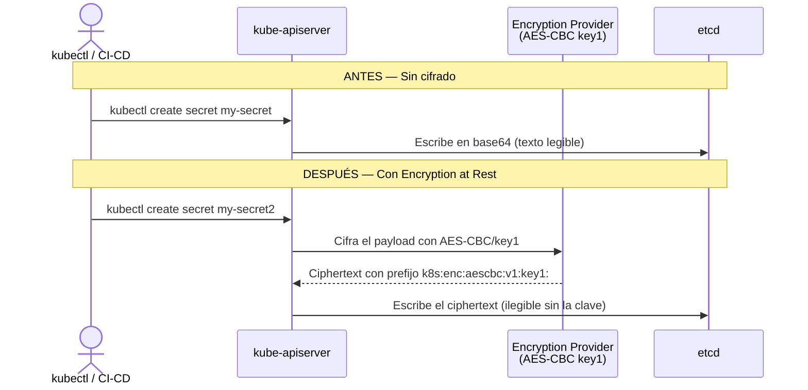

# Seguridad — Cifrado en Reposo de etcd (Encryption at Rest)

## Visión General

Por defecto, Kubernetes almacena todos los `Secrets` en `etcd` codificados en **base64**, pero sin ningún cifrado real. Cualquiera con acceso directo al servidor de `etcd` puede leer ese contenido en texto plano con un simple comando. El **Cifrado en Reposo** (`Encryption at Rest`) resuelve esto configurando el `kube-apiserver` para que cifre los secretos antes de escribirlos en `etcd`, usando el algoritmo AES-CBC con una clave de 32 bytes.

| Artefacto | Ubicación | Propósito |
|---|---|---|
| `EncryptionConfiguration` | `/etc/kubernetes/enc/enc.yaml` | Define el proveedor de cifrado y la clave |
| Flag del API Server | `--encryption-provider-config` | Apunta al archivo de configuración |
| Manifiesto del API Server | `/etc/kubernetes/manifests/kube-apiserver.yaml` | Se edita para activar el flag y montar el volumen |

El flujo de escritura de un Secret cambia así al activar el cifrado:



!!! warning "Este procedimiento se ejecuta dentro del nodo control-plane"
    Todos los comandos de las Fases 2 y 3 se ejecutan **dentro del contenedor del control plane** de Kind, no desde tu terminal de host. Accedés con `docker exec -it ftth-cluster-control-plane /bin/bash`.

---

## Desglose Técnico

### Fase 1 — Demostración de la Vulnerabilidad

Antes de configurar nada, este paso demuestra por qué el estado por defecto de Kubernetes es inseguro para datos sensibles. Es opcional pero altamente recomendado para el CKA, ya que el examen puede pedirte que verifiques si un secreto está o no cifrado.

#### Paso 1: Crear un Secret de prueba

```bash
# Crear un Secret genérico con un valor sensible
kubectl create secret generic my-secret --from-literal=key1=supersecret
```

```text
secret/my-secret created
```

#### Paso 2: Comprobar que base64 no es cifrado

Si inspeccionás el Secret con `kubectl get secrets my-secret -o yaml`, el campo `data.key1` aparece como `c3VwZXJzZWNyZXQ=`. Eso es simplemente base64, no cifrado:

```bash
# Decodificar el valor: cualquier persona con acceso puede hacer esto
echo "c3VwZXJzZWNyZXQ=" | base64 --decode
```

```text
supersecret
```

#### Paso 3: Leer el Secret directamente desde etcd

Este es el paso que prueba la vulnerabilidad real. Para hacerlo, necesitás acceder al nodo del control plane e interactuar con `etcd` usando sus certificados de autenticación.

Verificar que el Pod de `etcd` está corriendo:

```bash
kubectl get pods -n kube-system
```

```text
NAME                                              READY   STATUS    RESTARTS   AGE
coredns-76f75df574-htxgx                          1/1     Running   0          33m
etcd-ftth-cluster-control-plane                   1/1     Running   0          33m
kube-apiserver-ftth-cluster-control-plane         1/1     Running   0          33m
...
```

Desde **dentro del nodo control-plane**, verificar los certificados disponibles para autenticarse con `etcd`:

```bash
ls -la /etc/kubernetes/pki/etcd/
```

```text
total 40
drwxr-xr-x 2 root root 4096 May 20 13:40 .
drwxr-xr-x 3 root root 4096 May 20 13:40 ..
-rw-r--r-- 1 root root 1094 May 20 13:40 ca.crt
-rw------- 1 root root 1675 May 20 13:40 ca.key
-rw-r--r-- 1 root root 1123 May 20 13:40 healthcheck-client.crt
-rw------- 1 root root 1679 May 20 13:40 healthcheck-client.key
-rw-r--r-- 1 root root 1245 May 20 13:40 peer.crt
-rw------- 1 root root 1679 May 20 13:40 peer.key
-rw-r--r-- 1 root root 1245 May 20 13:40 server.crt
-rw------- 1 root root 1679 May 20 13:40 server.key
```

!!! info "¿Por qué se necesitan estos certificados?"
    `etcd` requiere autenticación TLS mutua (mTLS) para toda comunicación. Ni siquiera el `kube-apiserver` puede hablar con `etcd` sin presentar un certificado válido. Los archivos `server.crt` y `server.key` son las credenciales que usás para autenticarte como cliente. La `ca.crt` es la Autoridad Certificante que valida la conexión.

Instalar la herramienta cliente `etcdctl` dentro del nodo:

```bash
apt-get update && apt-get install -y etcd-client
```

```text
...
The following NEW packages will be installed:
  etcd-client
0 upgraded, 1 newly installed, 0 to remove and 67 not upgraded.
...
Setting up etcd-client (3.4.23-4+b4)
```

Consultar el Secret directamente en la base de datos:

```bash
ETCDCTL_API=3 etcdctl \
  --cacert=/etc/kubernetes/pki/etcd/ca.crt \
  --cert=/etc/kubernetes/pki/etcd/server.crt \
  --key=/etc/kubernetes/pki/etcd/server.key \
  get /registry/secrets/default/my-secret
```

```text
/registry/secrets/default/my-secret
...
{"f:data":{".":{},"f:key1":{}},"f:type":{}}B
key1
supersecretOpaque"
```

El valor `supersecret` aparece en texto plano. La vulnerabilidad está demostrada.

#### ¿Por qué `ETCDCTL_API=3`?

`etcdctl` soporta dos versiones de API (`v2` y `v3`). Kubernetes usa **exclusivamente la API v3** desde la versión 3.x de `etcd`. Sin este flag de entorno, el cliente intentaría usar la API v2 y el comando fallaría silenciosamente o retornaría resultados incorrectos.

| Variable de entorno | Valor | Efecto |
|---|---|---|
| `ETCDCTL_API=3` | `3` | Activa los comandos de la API v3 (`get`, `put`, `del`) |
| Sin variable | — | Usa API v2 por defecto (incompatible con K8s) |

#### Paso 4: Verificar que el cifrado aún no está activo

```bash
# Buscar el flag de cifrado en el proceso activo del API Server
ps aux | grep kube-api | grep "encryption-provider-config"
```

```text
(sin salida — el flag no está presente)
```

Sin salida significa que el `kube-apiserver` no tiene ningún proveedor de cifrado configurado.

---

### Fase 2 — Creación de la Configuración de Cifrado

#### Paso 5: Generar la clave de cifrado

```bash
# Generar 32 bytes aleatorios y codificarlos en base64
head -c 32 /dev/urandom | base64
```

```text
<PEGAR_AQUÍ_LA_CLAVE_GENERADA_EN_PASO_5>
```

#### ¿Por qué 32 bytes y base64?

El algoritmo AES-CBC que usa Kubernetes para el cifrado en reposo requiere una clave de exactamente **256 bits = 32 bytes**. La codificación en base64 es necesaria porque el archivo YAML no acepta bytes binarios directamente; necesita la clave representada como texto ASCII.

!!! warning "Esta clave es el único punto de fallo"
    Si perdés esta clave, **perdés acceso a todos los Secrets cifrados con ella**. En producción, esta clave se gestiona a través de un KMS (Key Management Service) como AWS KMS o HashiCorp Vault. Nunca la guardes en el repositorio de código.

#### Paso 6: Crear el archivo `enc.yaml`

Dentro del nodo control-plane, crear el archivo con la clave generada:

```yaml
apiVersion: apiserver.config.k8s.io/v1
kind: EncryptionConfiguration
resources:
  - resources:
      - secrets
    providers:
      - aescbc:
          keys:
            - name: key1
              secret: <PEGAR_AQUÍ_LA_CLAVE_GENERADA_EN_PASO_5>
      - identity: {}  # Permite leer secretos no cifrados durante la migración inicial
```

#### ¿Por qué `identity: {}` al final y no al principio?

El orden de los `providers` importa. El **primer proveedor** de la lista es el que se usa para **escribir** nuevos secretos. Los proveedores siguientes se intentan en orden para **leer** secretos existentes.

| Posición de `identity: {}` | Efecto |
|---|---|
| Primero (antes de `aescbc`) | Todos los secretos se escriben sin cifrar. Cifrado desactivado en la práctica. |
| Último (después de `aescbc`) | Los secretos nuevos se cifran con AES-CBC. Los secretos viejos (sin cifrar) se siguen pudiendo leer durante la migración. ✅ |

`identity: {}` es el proveedor nulo: lee y escribe sin transformación. Es necesario durante la migración para que el API Server pueda leer los secretos viejos (como `my-secret`) mientras no hayan sido re-cifrados todavía.

!!! tip "La extensión del archivo importa"
    El archivo debe llamarse `enc.yaml` (con `.yaml`), no `enc.yml`. El flag del API Server es case-sensitive respecto a la extensión.

#### Paso 7: Ubicar el archivo en el directorio seguro

```bash
# Crear el directorio dedicado
mkdir /etc/kubernetes/enc/

# Mover el archivo al directorio
mv enc.yaml /etc/kubernetes/enc/

# Verificar que está en su lugar
ls /etc/kubernetes/enc/
```

```text
enc.yaml
```

#### ¿Por qué `/etc/kubernetes/enc/` y no otro directorio?

El directorio `/etc/kubernetes/` ya está **montado como volumen** en el Pod del `kube-apiserver` por defecto (para acceder a los manifiestos y PKI). Crear un subdirectorio allí simplifica la configuración del volumen adicional. Usar un directorio fuera de `/etc/kubernetes/` requeriría un `hostPath` más complejo y permisos adicionales en el nodo.

---

### Fase 3 — Reconfiguración del API Server

El `kube-apiserver` en entornos Kind (y en general en clústeres creados con `kubeadm`) se gestiona como un **Static Pod**: su manifiesto YAML vive en `/etc/kubernetes/manifests/` y el `kubelet` lo monitorea directamente. Cualquier cambio en ese archivo hace que el `kubelet` destruya y recree el Pod automáticamente, sin intervención manual.

#### Paso 8: Editar el manifiesto del API Server

```bash
vi /etc/kubernetes/manifests/kube-apiserver.yaml
```

Hay que realizar **tres modificaciones** en bloques distintos del mismo archivo:

**A — Agregar el flag al array de comandos (`spec.containers[0].command`)**

```yaml
    - --encryption-provider-config=/etc/kubernetes/enc/enc.yaml
```

**B — Agregar el `volumeMount` al contenedor (`spec.containers[0].volumeMounts`)**

```yaml
    - name: enc
      mountPath: /etc/kubernetes/enc
      readOnly: true
```

**C — Agregar el volumen al Pod (`spec.volumes`)**

```yaml
  - name: enc
    hostPath:
      path: /etc/kubernetes/enc
      type: DirectoryOrCreate
```

#### ¿Por qué se necesitan las tres modificaciones?

Estas tres piezas trabajan en conjunto usando el mismo mecanismo de montaje de volúmenes que ya viste en el [Frontend con su ConfigMap](../architecture/frontend.md):

| Modificación | Función |
|---|---|
| `spec.volumes` | Le dice a Kubernetes que el directorio `/etc/kubernetes/enc` del **nodo** existe como volumen llamado `enc` |
| `spec.containers[0].volumeMounts` | Monta ese volumen dentro del **contenedor** del API Server en la misma ruta |
| `spec.containers[0].command` | Le dice al proceso del API Server dónde encontrar el archivo de configuración dentro del contenedor |

Sin el volumen y el mount, el proceso del `kube-apiserver` no puede ver el archivo `enc.yaml`, aunque esté en el nodo. Sin el flag, el proceso ni siquiera busca ese archivo.

!!! info "El `kubelet` como guardia del Static Pod"
    Después de guardar el archivo, el `kubelet` detecta el cambio en cuestión de segundos y reinicia el Pod del `kube-apiserver`. Durante ese reinicio (que dura entre 30 y 60 segundos), el clúster no acepta nuevas operaciones. Es normal ver errores temporales de `connection refused` al hacer `kubectl get pods` en ese momento.

#### Paso 9: Verificar que el API Server tomó los cambios

```bash
# Confirmar que el proceso activo ya tiene el flag de cifrado
ps aux | grep kube-api | grep encryp
```

```text
kube-apiserver --advertise-address=172.21.0.3 ... --encryption-provider-config=/etc/kubernetes/enc/enc.yaml
```

El flag aparece al final de la cadena de argumentos del proceso. Si no aparece, esperá 30 segundos más y reintentá (el API Server puede estar todavía reiniciándose).

---

### Fase 4 — Validación y Migración de Secretos

#### Paso 10: Verificar que los nuevos secretos se cifran

```bash
# Crear un nuevo Secret post-configuración
kubectl create secret generic my-secret2 --from-literal=key2=topsecret
```

```text
secret/my-secret2 created
```

Luego consultar su representación en `etcd`:

```bash
ETCDCTL_API=3 etcdctl \
  --cacert=/etc/kubernetes/pki/etcd/ca.crt \
  --cert=/etc/kubernetes/pki/etcd/server.crt \
  --key=/etc/kubernetes/pki/etcd/server.key \
  get /registry/secrets/default/my-secret2 | hexdump -C
```

```text
... |/registry/secret|
... |s/default/my-sec|
... |ret2.k8s:enc:aes|
... |cbc:v1:key1: ...|
```

El prefijo `k8s:enc:aescbc:v1:key1:` confirma que el Secret fue cifrado con el proveedor `aescbc` usando la clave llamada `key1`. El contenido después del prefijo es ciphertext ilegible.

#### ¿Por qué `hexdump -C` y no solo `get`?

El `get` directo de `etcdctl` imprime caracteres binarios al terminal, lo que puede ser confuso o corromper la salida de la sesión. `hexdump -C` convierte el output binario a una representación hexadecimal + ASCII imprimible, que es lo que te permite ver el prefijo `k8s:enc:aescbc:v1:key1:` de forma legible.

#### Paso 11: Migrar los secretos existentes al nuevo cifrado

El Secret `my-secret` creado en el Paso 1 sigue almacenado en texto plano en `etcd`. La configuración de cifrado **solo afecta a escrituras nuevas**, no modifica retroactivamente los secretos existentes.

Para forzar que todos los secretos pasen por el Encryption Provider, hay que releerlos y reescribirlos:

```bash
# Leer todos los Secrets de todos los namespaces y reescribirlos
kubectl get secrets --all-namespaces -o json | kubectl replace -f -
```

La salida muestra cada Secret siendo reemplazado:

```text
secret/my-secret replaced
secret/default-token-xxxxx replaced
secret/kube-proxy-token-xxxxx replaced
...
```

#### ¿Por qué `replace` y no `apply`?

`kubectl replace` fuerza la **reescritura completa** del objeto en la API, lo que hace que el `kube-apiserver` lo procese a través del Encryption Provider antes de enviarlo a `etcd`. `kubectl apply` solo envía un patch con las diferencias, y si el objeto no cambió, puede que no desencadene una reescritura completa. `replace` garantiza el cifrado de todos los secretos sin excepción.

!!! tip "Verificación final"
    Después de la migración, si volvés a consultar `my-secret` con `etcdctl get`, ahora también deberías ver el prefijo `k8s:enc:aescbc:v1:key1:` en lugar del texto plano `supersecret`.

---

## Instrucciones de Operación

### Resumen de ejecución completa

```bash
# === DESDE TU HOST ===

# 1. Crear Secret de prueba (para demostrar vulnerabilidad)
kubectl create secret generic my-secret --from-literal=key1=supersecret

# 2. Ingresar al nodo control-plane
docker exec -it ftth-cluster-control-plane /bin/bash

# === DENTRO DEL NODO CONTROL-PLANE ===

# 3. Generar clave de cifrado
head -c 32 /dev/urandom | base64

# 4. Crear directorio y archivo de configuración
mkdir /etc/kubernetes/enc/
cat > /etc/kubernetes/enc/enc.yaml << 'EOF'
apiVersion: apiserver.config.k8s.io/v1
kind: EncryptionConfiguration
resources:
  - resources:
      - secrets
    providers:
      - aescbc:
          keys:
            - name: key1
              secret: <TU_CLAVE_GENERADA_EN_PASO_3>
      - identity: {}
EOF

# 5. Editar el manifiesto del API Server (agregar flag, volumeMount y volume)
vi /etc/kubernetes/manifests/kube-apiserver.yaml

# 6. Esperar el reinicio del API Server (~60 segundos)
watch kubectl get pods -n kube-system

# === DESDE TU HOST (después del reinicio) ===

# 7. Verificar que el flag está activo
ps aux | grep kube-api | grep encryp

# 8. Migrar secretos existentes
kubectl get secrets --all-namespaces -o json | kubectl replace -f -
```

### Verificar el estado del cifrado

```bash
# Confirmar que el API Server tiene el flag activo
ps aux | grep kube-api | grep "encryption-provider-config"

# Verificar que un Secret nuevo está cifrado en etcd (desde dentro del nodo)
ETCDCTL_API=3 etcdctl \
  --cacert=/etc/kubernetes/pki/etcd/ca.crt \
  --cert=/etc/kubernetes/pki/etcd/server.crt \
  --key=/etc/kubernetes/pki/etcd/server.key \
  get /registry/secrets/default/<nombre-del-secret> | hexdump -C | grep "enc:aes"
```

### Debugging

```bash
# Si el API Server no levanta después de editar el manifiesto
# Ver los logs del kubelet que describe el error del Static Pod
journalctl -u kubelet -f --no-pager | grep -i "kube-apiserver"

# Si kubectl no responde (API Server reiniciándose)
# Esperar y reintentar
kubectl get nodes

# Ver los eventos del namespace kube-system
kubectl get events -n kube-system --sort-by=.lastTimestamp | grep -i "apiserver"

# Si el API Server arranca pero el cifrado no funciona
# Verificar que el archivo enc.yaml está bien montado dentro del contenedor
kubectl exec -n kube-system kube-apiserver-ftth-cluster-control-plane -- \
  ls -la /etc/kubernetes/enc/
```

!!! warning "Síntoma crítico: `kube-apiserver` no levanta después de editar el manifiesto"
    Si el API Server no vuelve a estar en `Running` después de 2-3 minutos, el error más común es un YAML mal formado en `kube-apiserver.yaml`. Volvé a editar el manifiesto y verificá la indentación. Un error de sintaxis en ese archivo deja el clúster completamente inaccesible hasta que se corrija.
