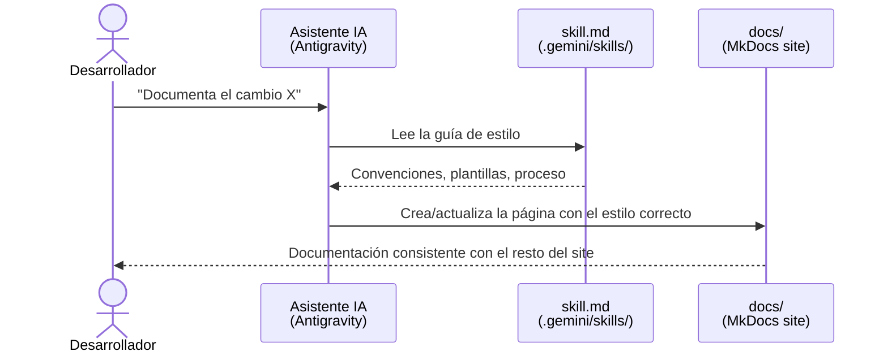

# Guía de Estilo — Documentación del Proyecto

## Visión General

Esta guía codifica todas las convenciones de escritura, estructura y proceso que se usan para documentar el proyecto FTTH-K8s. Su objetivo es garantizar que toda la documentación sea **consistente, profesional y parezca escrita por una sola persona**, independientemente de cuándo o cómo fue generada.

| Artefacto | Ubicación | Propósito |
|---|---|---|
| Skill (fuente de verdad) | `.gemini/skills/documentation-agent/artifacts/doc_skill.md` | Leída por el asistente IA antes de cada tarea de documentación |
| Guía pública (este archivo) | `docs/skills/doc-style-guide.md` | Versión legible para humanos publicada en el site |

El flujo de uso es el siguiente:



!!! tip "Por qué existe esta Skill"
    Sin una guía de referencia, cada tarea de documentación requiere inspeccionar todos los archivos existentes para inferir las convenciones. Con la Skill, el asistente carga el contexto en segundos, gasta menos tokens y produce resultados de mayor calidad desde el primer intento.

---

## Contexto del Proyecto

- **Stack**: Kind + Kubernetes + Python/Flask + Redis + Nginx + BusyBox
- **Motor de documentación**: MkDocs Material (`mkdocs.yml` en la raíz)
- **Idioma**: Español en las explicaciones. Código, comandos y nombres de recursos K8s en inglés.
- **Audiencia dual**: reproducir el laboratorio + estudiar para la certificación CKA.

### Estructura de `docs/`

```
docs/
├── index.md
├── getting-started/
│   ├── index.md
│   ├── kind-config.md
│   └── manage-env.md
├── architecture/
│   ├── index.md
│   ├── frontend.md
│   ├── backend.md
│   ├── redis.md
│   └── cronjob.md
├── manifests/
│   ├── index.md
│   ├── deployments.md
│   ├── services.md
│   ├── configmaps.md
│   └── metrics-server.md
├── operations/
│   ├── index.md
│   ├── ci-cd-pipeline.md
│   └── docs-pipeline.md
├── security/
│   ├── index.md
│   └── encryption-at-rest.md
└── skills/
    ├── index.md
    └── doc-style-guide.md
```

---

## Estructura Estándar de Cada Página

Toda página de arquitectura o componente sigue este orden de secciones:

```
# Nombre del Componente — Subtítulo Descriptivo

## Visión General
## Desglose Técnico
### Artefacto — ruta/al/archivo
#### ¿Por qué X?
## Instrucciones de Operación
### Aplicar los recursos
### Verificar el estado
### Debugging
```

---

## Reglas de Estilo

### Voz y Tono

| Regla | Correcto | Incorrecto |
|---|---|---|
| Segunda persona informal | "Cuando ejecutas..." | "Cuando el usuario ejecuta..." |
| Presente indicativo | "El Service enruta el tráfico" | "El Service enrutará el tráfico" |
| Frases directas | "Esta es la decisión clave." | "Es importante mencionar que..." |
| Nombres K8s sin traducir | `` `Deployment` ``, `` `CronJob` `` | "Despliegue", "TareaProgamada" |
| Énfasis con negrita | `**alta disponibilidad**` | ALTA DISPONIBILIDAD |

### Preguntas Retóricas como Subtítulos `h4`

Cada bloque de código de manifiesto va seguido de al menos un `####` con la justificación técnica de la decisión de diseño:

```
#### ¿Por qué `imagePullPolicy: Never`?
#### ¿Por qué ClusterIP y no NodePort?
#### ¿Por qué `host='0.0.0.0'` en Flask?
```

### Tablas de Comparación

Siempre que haya 3 o más opciones posibles, se usa una tabla en lugar de una lista:

| Tipo de Service | Accesible desde | Uso en este proyecto |
|---|---|---|
| `ClusterIP` | Solo dentro del clúster | Backend, Redis |
| `NodePort` | Host local y red local | Frontend (dashboard) |
| `LoadBalancer` | Internet (requiere cloud provider) | No utilizado |

---

## Componentes de MkDocs Material

### Admonitions

Solo se usan tres tipos. Su uso es estricto:

```markdown
!!! info "Cómo funciona el DNS interno de Kubernetes"
    Explicación de un mecanismo interno de K8s.

!!! tip "Herramienta de referencia"
    Buenas prácticas, optimizaciones, herramientas externas.

!!! warning "Síntoma común: ImagePullBackOff"
    Errores frecuentes, trampas, restricciones de Kind.
```

### Diagramas Mermaid

- `sequenceDiagram`: flujos de request/response entre componentes (página de arquitectura).
- `graph LR`: arquitectura de alto nivel (página `index.md`).

```markdown
    ```mermaid
    sequenceDiagram
        participant A as Componente A
        participant B as Componente B
        A->>B: Petición
        B-->>A: Respuesta
    ```
```

### Bloques de Código

| Lenguaje | Identificador |
|---|---|
| Shell / Bash | `bash` |
| YAML (manifiestos K8s) | `yaml` |
| Python | `python` |
| Dockerfile | `dockerfile` |
| Salida de comandos | *(sin identificador)* |
| JSON | `json` |

---

## Proceso para Documentar un Cambio

### Paso 1 — Clasificar el cambio

| Tipo de cambio | Sección destino |
|---|---|
| Nuevo componente K8s (Deployment, Service, etc.) | `docs/architecture/` |
| Cambio a manifiesto YAML existente | Página de arquitectura del componente |
| Nuevo pipeline CI/CD o automatización | `docs/operations/` |
| Nueva herramienta o prerequisito | `docs/getting-started/` |
| Hardening, RBAC, cifrado, NetworkPolicy | `docs/security/` |
| Nueva guía de trabajo o workflow | `docs/skills/` |

### Paso 2 — Construir la página

1. Extraer el código real del proyecto (nunca inventarlo).
2. Para cada bloque de código → escribir al menos un `#### ¿Por qué?`.
3. Incluir al menos un admonition por página.
4. Si hay flujo entre componentes → incluir diagrama `sequenceDiagram`.

### Paso 3 — Verificar antes de entregar

- [ ] El `H1` sigue el patrón `Nombre — Subtítulo`
- [ ] La sección "Visión General" tiene tabla de artefactos/recursos
- [ ] El código es el código real del proyecto
- [ ] Las rutas usan el patrón `k8s/NN-tipo/nombre.yaml`
- [ ] Hay sección "Instrucciones de Operación" con sus 3 subsecciones
- [ ] El idioma de las explicaciones es español
- [ ] Si es página nueva → `mkdocs.yml` fue actualizado en `nav:`

---

## Qué NO Hacer

- ❌ `kubectl create` en los ejemplos — siempre `kubectl apply`
- ❌ Inventar nombres de recursos sin leer el YAML real
- ❌ Explicaciones en inglés
- ❌ Omitir el `#### ¿Por qué...?` en nuevos bloques de manifiestos
- ❌ Crear páginas sin actualizar `mkdocs.yml`
- ❌ Usar admonitions `caution` o `danger` (fuera del estilo establecido)
- ❌ Párrafos de más de 5 líneas sin un ejemplo, tabla o bloque de código
- ❌ Alterar el orden de las secciones principales

---

## Convenciones de Nomenclatura

| Elemento | Patrón | Ejemplo |
|---|---|---|
| Recursos K8s | `ftth-[componente]` | `ftth-backend` |
| Services | `ftth-[componente]-service` | `ftth-backend-service` |
| Imágenes Docker | `ftth-[componente]:v[N]` | `ftth-backend:v1` |
| Label `app:` | `ftth-[componente]` | `app: ftth-frontend` |
| Label `tier:` | `frontend` / `backend` / `data` / `worker` | `tier: backend` |
| Rutas a manifiestos | `k8s/NN-tipo/nombre-tipo.yaml` | `k8s/03-deployments/backend-deployment.yaml` |
| Puerto Frontend | `30080` | — |
| Puerto KubeView | `30088` | — |
| Nombre del clúster | `ftth-cluster` | — |
