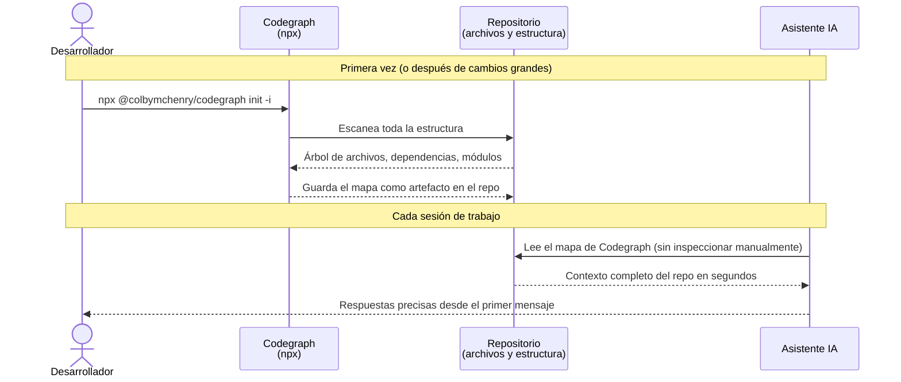

# Codegraph — Mapa Estructural del Repositorio

## Visión General

**Codegraph** es una herramienta de código abierto que analiza tu repositorio y genera un **mapa estático de su estructura**: archivos, directorios, dependencias entre módulos y relaciones entre componentes. Este mapa se guarda como un artefacto dentro del repo y puede ser consumido directamente por un asistente de IA al inicio de cada sesión de trabajo.

El problema que resuelve es concreto: sin esta herramienta, cada vez que iniciás una nueva conversación con un asistente de IA, el asistente necesita inspeccionar el repositorio desde cero para entender cómo está organizado. Eso consume tiempo, tokens y produce respuestas menos precisas en las primeras interacciones. Codegraph elimina ese costo fijo.

| Artefacto | Descripción |
|---|---|
| Mapa generado por `init` | Snapshot estático de la estructura completa del repo |
| Actualización por `sync` | Refresca el mapa cuando el repo tuvo cambios significativos |

El flujo de trabajo con Codegraph es el siguiente:



!!! tip "Codegraph en números"
    En un repositorio de tamaño mediano, el asistente normalmente necesita entre 5 y 15 llamadas de exploración de archivos al inicio de una sesión para entender la estructura. Con Codegraph, ese número cae a **0**: el contexto ya está disponible en el mapa generado.

---

## Desglose Técnico

### Instalación y uso — sin instalación global

Codegraph se ejecuta directamente con `npx`, sin necesidad de instalarlo globalmente en el sistema. `npx` descarga y ejecuta el paquete en el momento, usando siempre la versión más reciente.

```bash
# No se necesita: npm install -g @colbymchenry/codegraph
# npx lo gestiona automáticamente
```

---

### Comando `init` — Generar el mapa por primera vez

```bash
npx @colbymchenry/codegraph init -i
```

Este es el comando de inicialización. Escanea el repositorio completo desde el directorio donde se ejecuta y genera el mapa estructural.

#### ¿Qué hace exactamente `init -i`?

El flag `-i` activa el modo **interactivo**: en lugar de usar una configuración por defecto, la herramienta te pregunta qué carpetas y tipos de archivos incluir o excluir del análisis. Esto es importante porque en proyectos como este, hay directorios que no aportan valor al mapa (como `venv/`, `site/`, `.git/`) y que solo agregarían ruido.

#### ¿Cuándo ejecutar `init`?

| Situación | Acción |
|---|---|
| Primera vez que configurás el proyecto | `init -i` (una sola vez) |
| El repo tuvo una reestructuración grande | `sync` (ver más abajo) |
| Cambiaste la configuración de exclusiones | `init -i` nuevamente |

!!! warning "Ejecutá siempre desde la raíz del repositorio"
    Codegraph construye el mapa relativo al directorio de ejecución. Si lo ejecutás desde un subdirectorio, el mapa estará incompleto y el asistente tendrá una visión parcial del proyecto.

---

### Comando `sync` — Actualizar el mapa

```bash
npx @colbymchenry/codegraph sync
```

Este comando refresca el mapa existente sin pasar por el proceso interactivo de `init`. Usa la configuración ya guardada y actualiza el artefacto con los cambios recientes del repositorio.

#### ¿Por qué existe un comando separado de `sync`?

El mapa generado por `init` es un **snapshot**: refleja el estado del repositorio en el momento de la ejecución. Si después agregás nuevas secciones de documentación, nuevos componentes de Kubernetes o reorganizás directorios, el mapa queda desactualizado. `sync` permite actualizarlo en segundos, sin reconfigurar todo desde cero.

#### ¿Cuándo ejecutar `sync`?

| Situación | Acción recomendada |
|---|---|
| Agregaste o renombraste archivos individuales | No es necesario, cambios menores |
| Agregaste una nueva sección completa de docs | `sync` |
| Incorporaste un nuevo componente al clúster | `sync` |
| Reorganizaste la estructura de directorios | `sync` |
| Van a trabajar en el repo después de semanas sin actividad | `sync` |

!!! info "Frecuencia recomendada"
    No hace falta ejecutar `sync` después de cada commit. El punto de inflexión es cuando la estructura del repositorio cambió lo suficiente como para que el mapa anterior induzca al asistente a buscar archivos donde ya no están, o a no saber que existen nuevos directorios.

---

## Beneficios para el Flujo de Trabajo con IA

Codegraph no solo ahorra tokens — mejora la calidad del trabajo de forma medible:

| Beneficio | Sin Codegraph | Con Codegraph |
|---|---|---|
| **Costo de contexto inicial** | 5-15 llamadas de exploración por sesión | 0 llamadas de exploración |
| **Precisión de rutas** | El asistente puede asumir rutas incorrectas | El asistente conoce la estructura exacta |
| **Consistencia entre sesiones** | Cada sesión "redescubre" el repo | Todas las sesiones parten del mismo contexto |
| **Velocidad de respuesta** | Los primeros mensajes son lentos (exploración) | Respuestas precisas desde el primer mensaje |
| **Errores de "archivo no encontrado"** | Frecuentes en repos medianos y grandes | Prácticamente eliminados |
| **Tokens por sesión** | Alto (exploración + tarea) | Bajo (solo la tarea) |

!!! tip "Combinado con las Skills del proyecto"
    Codegraph y las [Skills](../skills/index.md) son complementarios: Codegraph le da al asistente el **mapa del territorio** (qué archivos existen y dónde), mientras que las Skills le dan las **reglas del juego** (cómo se hacen las cosas en este repo). Juntos, eliminan casi completamente la fase de exploración inicial en cada sesión.

---

## Instrucciones de Operación

### Configuración inicial (una sola vez)

```bash
# Desde la raíz del repositorio
npx @colbymchenry/codegraph init -i
```

Seguí las instrucciones interactivas. Cuando te pregunte qué excluir, incluí al menos:

```
venv/
site/
.git/
node_modules/
__pycache__/
```

### Actualizar el mapa

```bash
# Desde la raíz del repositorio, después de cambios estructurales significativos
npx @colbymchenry/codegraph sync
```

### Verificar que el mapa está actualizado

Después de ejecutar `init` o `sync`, verificá que el artefacto fue generado o actualizado correctamente:

```bash
# Ver qué archivos generó o modificó Codegraph
git status

# Confirmar la fecha de última modificación del mapa
ls -la .codegraph/   # o el directorio que use la herramienta
```

!!! warning "Committear el mapa al repositorio"
    El artefacto generado por Codegraph debe estar commiteado en el repositorio. Si lo agregás al `.gitignore` por error, el asistente de IA no podrá acceder a él en otras máquinas o en nuevas sesiones clonadas desde GitHub.
